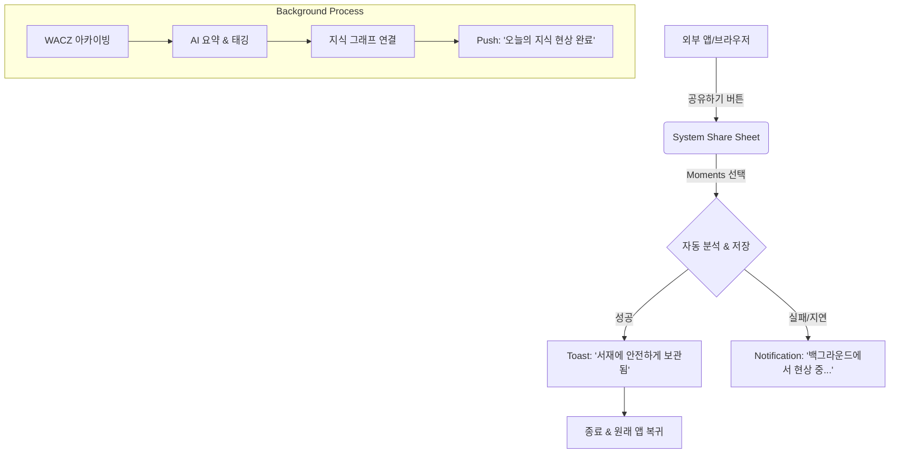
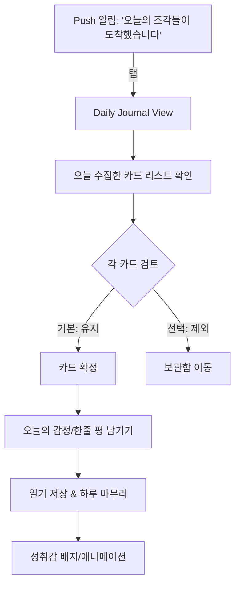
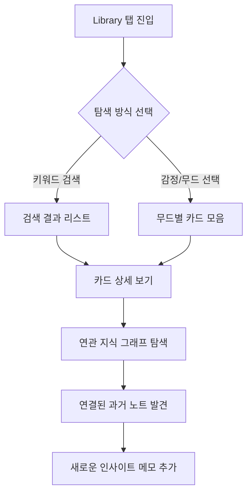

# UX Design Specification moments

**Author:** 마스터
**Date:** 2026-01-17

---

<!-- UX design content will be appended sequentially through collaborative workflow steps -->

## Executive Summary

### Project Vision
Moments는 정보 관리 도구가 아니라, 사용자가 자신의 지식과 감정을 되찾는 "지식 사진관" 경험을 제공한다. 핵심은 2초 캡처 → 자동 연결 → 밤 9시 일기 루틴으로 이어지는 일상적 리듬을 만드는 것이다. 따뜻한 서재/갤러리 톤, 폴라로이드 메타포, 여백 중심의 레이아웃을 통해 감정적으로 안전한 공간을 만든다.

### Target Users
지식을 좋아하지만 정리에 지친 현대인. 출퇴근 중 모바일로 빠르게 캡처하고, 필요 시 웹에서 정리/재발견한다. 기술 친숙도는 중간 수준으로, 복잡한 설정 없이 바로 이해되는 흐름이 필요하다.

### Key Design Challenges
- 출퇴근 맥락에서도 2초 내에 캡처/기록이 가능한 "초저마찰" 흐름 설계
- 자동 연결과 분류 결과를 신뢰하게 만드는 설명/피드백 UX
- "정리된 지식이 한눈에 보이는 순간"을 빠르게 제공하는 정보 구조

### Design Opportunities
- 모바일(Android) 우선 UX로 캡처→간단 분류→정리 감각을 즉시 제공
- 웹에서 '정리된 지식'의 가시화를 강화(테마/타임라인/무드 기반 뷰)
- "나의 지식이 되었다"는 감정을 강화하는 큐레이션/리플렉션 패턴

## Core User Experience

### Defining Experience
핵심 경험은 "빠른 캡처"에 있다. 사용자는 생각 없이 스크랩하고, 이후 자동 정리를 통해 지식이 쌓였다는 감각을 얻는다. 핵심 루프는 "스크랩 → 정리 → 탐색 → 하루일기 → 개인 지식화"로 이어진다.

### Platform Strategy
- Android 앱: 캡처 중심
- 웹(PC): 정리 중심
- 탐색/일기: 모바일과 웹 모두 지원
- 오프라인: 가능한 최대치까지 지원하여 프라이버시와 데이터 소유 문제를 해결

### Effortless Interactions
- 사용자는 "정리해야 한다"는 부담 없이 스크랩만 하면 된다
- 자동 정리(메타데이터/요약/문서화)와 자동 연결(지식 그래프)은 사용자 개입 없이 이루어진다
- 캡처 직후 "정리되는 느낌"을 주는 즉각 피드백 제공

### Critical Success Moments
- 사용자가 정리 스트레스 없이 스크랩하고 있는 자신을 발견하는 순간
- 첫 사용에서 "자동 정리 결과가 만족스럽다"는 확신을 얻는 순간

### Experience Principles
- 초저마찰 캡처: 생각 없이 스크랩 가능해야 한다
- 자동 정리 신뢰성: 정리가 가장 완벽해야 하며 실패하면 경험이 무너진다
- 오프라인 우선: 데이터 소유·프라이버시를 체감하게 한다
- 정리의 가시성: "내 지식이 되었다"는 결과를 즉시 보여준다

## Desired Emotional Response

### Primary Emotional Goals
- 핵심 감정: 신뢰
- 추천/입소문을 유도하는 감정: 성취감
- 핵심 행동 직후: 뿌듯함/성취감/안도감
- 경쟁 서비스와의 차별 감정: 부담감(경쟁) → 편안함(우리)

### Emotional Journey Mapping
- 첫 발견: "또 스크랩앱이야?"라는 지겨움
- 사용 중: "어.. 좀 다르네"라는 색다름/신선함
- 완료 후: "오~ 좋다"라는 긍정/편안함
- 문제 발생 시: "곧 알아서 정리될 거야"라는 안심/신뢰

### Micro-Emotions
- 신뢰 vs 의심
- 성취 vs 좌절
- 즐거움 vs 무감각

### Design Implications
- 자동 정리 상태 가시화(진행/완료/대기)와 결과 미리보기 제공
- 정리 결과를 즉시 보여주는 "오늘의 정리 카드" 영역
- 신뢰를 주는 마이크로카피("알아서 정리해둘게요", "곧 준비됩니다")
- 성취감 피드백(작은 완성 표시, 오늘의 지식 1개 완성)
- 오류 시 '실패' 대신 '진행 중/곧 완료' 톤으로 안정감 유지

### Emotional Design Principles
- 부담을 덜고 편안함을 주는 톤
- 자동화 결과를 눈으로 확인하게 해 신뢰 확보
- 작은 성취를 자주 보여주는 리듬

## UX Pattern Analysis & Inspiration

### Inspiring Products Analysis
- Obsidian: 심플한 기본 흐름, 커스터마이즈 강점이 있으나 과도한 설정은 피하고 싶음
- Notion: "대충해도 예쁨"이 주는 만족감, DB 구조의 정돈된 감각
- Evernote: 매우 간단한 UX와 안정적인 동기화 경험

### Transferable UX Patterns
- 기본 화면의 심플함(Obsidian/Evernote): 최소 기능으로 시작하는 첫 화면
- "대충해도 예쁨"(Notion): 기본 템플릿/카드 자동 정렬로 즉시 미려한 결과
- 정리 결과의 구조화(Notion DB): 자동 분류 결과를 명확한 구조로 보여주기
- 신뢰 기반 동기화 감각(Evernote): 정리/동기화 상태의 가시화

### Anti-Patterns to Avoid
- 과도한 커스터마이즈 옵션 제공(설정 과다, 복잡한 선택지)
- 시작부터 복잡한 정보 구조 강요
- 정리 과정을 사용자가 직접 설계해야 하는 경험

### Design Inspiration Strategy
**Adopt**
- 기본 화면의 심플함(Evernote/Obsidian)
- "대충해도 예쁜 결과"를 주는 자동 레이아웃/카드 정렬(Notion)

**Adapt**
- Notion의 DB 구조 → 자동 정리 결과를 "보여주는 구조"로 축소 적용
- Obsidian의 유연성 → 옵션 최소화된 '추천 정리'로 변환

**Avoid**
- 커스터마이즈 과다
- 복잡한 설정/분류 요구

## Design System Foundation

### 1.1 Design System Choice
- 크로스플랫폼 통일: React Native + Expo + Tamagui
- iOS/Android/Web 공통 컴포넌트 체계 사용
- 공통 토큰(색/타입/간격/라디우스) 기반 일관성 유지

### Rationale for Selection
- 운영 간소화: 단일 컴포넌트/토큰으로 유지보수 비용 최소화
- 초·중급 팀에 적합한 DX 및 문서/생태계
- 브랜드가 없으므로 토큰 기반으로 점진적 브랜딩 구축 가능
- 모바일·웹 UX 일관성 확보

### Implementation Approach
- 1차: 기본 컴포넌트 + 최소 커스터마이즈로 MVP
- 2차: 토큰 확정 후 테마 확장
- 3차: 핵심 화면에만 커스텀 컴포넌트 추가

### Customization Strategy
- "심플함 + 대충해도 예쁨"을 기본값으로 설계
- 사용자 커스터마이즈는 최소화
- 자동 정리 상태/결과 가시화를 위한 카드/상태 컴포넌트 우선 설계

## 2. Core User Experience

### 2.1 Defining Experience
“정리하지 않아도 되는, 자동으로 정리되는 스크랩 경험.”

### 2.2 User Mental Model
- 현재 해결 방식: 북마크, Notion 저장, Obsidian 클리핑, 카카오톡 내게 보내기 등 분산 수집
- 기대: 공유하기/URL 입력만 하면 핵심이 추출되고 의미 있는 지식으로 정리됨
- 혼란 지점: “스크랩 앱인가? 일기 앱인가?”의 정체성 혼선
  - 정리 방향: 스크랩이 핵심, 일기는 감성/성찰을 통해 개인 지식화로 이어지는 보조 경험

### 2.3 Success Criteria
- 웹 데이터가 광고/불필요 요소 없이 ‘정리된 문서’로 전환됨
- 정리된 데이터가 유관 데이터와 자동 연결되어 지식으로 확장됨
- 연결된 지식이 사용자 성찰을 유도해 ‘나를 더 잘 알게 됨’
- 속도: 캡처는 2초 이내, 정리는 10분 이내(현상되는 느낌)

### 2.4 Novel UX Patterns
- 기존 패턴(캡처+자동 정리)로 충분함
- 교육/튜토리얼 의존은 지양

### 2.5 Experience Mechanics
**1) Initiation**
- 모바일/웹에서 공유하기로 솔루션에 전달 또는 URL 붙여넣기

**2) Interaction**
- 공유/저장 → 정리된 카드 확인 → 연결된 지식 탐색 → 저녁 일기 작성

**3) Feedback**
- 성공: 사진 인화처럼 정리된 카드 묶음 제공
- 진행: 암실에서 현상되는 듯한 은은한 진행 상태
- 오류: 낡은 사진 카드 + “도움이 필요해요” 톤
  - 사용자가 일부 수정/자료 보강 → 시스템이 재현상
  - 옵션: 사용자 직접 수정으로 시스템 자동 보정 비활성화 가능(명확한 토글/설명 포함)

**4) Completion**
- 완료: 당일 정리된 데이터로 일기 마무리
- 다음: 축적된 데이터로 과거 회상/자기 성찰

## Visual Design Foundation

### Color System
**Theme: Warm Archive**
- Primary: #8C5E45 (Warm Brown) - 신뢰와 안정감
- Secondary: #2C2420 (Dark Wood) - 텍스트 및 강한 강조
- Background: #F7F5F0 (Paper White) - 눈이 편안한 종이 질감
- Surface: #FFFFFF (Card White) - 콘텐츠 가독성 확보
- Border: #DCD6CE (Soft Beige) - 은은한 구분선

**Semantic Colors**
- Success: #4A6B56 (Muted Green) - 성취감/완료
- Warning: #D4A24E (Warm Amber) - 주의
- Error: #B85C5C (Soft Red) - 오류/삭제 (자극적이지 않게)

### Typography System
**Tone: Modern & Classic Hybrid**
- Headings: Serif 계열 (예: Merriweather/DM Serif) - 서재/책 느낌
- Body: Sans-serif 계열 (예: Inter/Pretendard) - 모바일 가독성 최적화
- Scale: 모바일 우선의 간결한 4단계 스케일 (H1, H2, Body, Caption)

### Spacing & Layout Foundation
**Grid & Spacing**
- Base Unit: 8px
- Layout: 여백이 넉넉한 갤러리형 (Dense하지 않음)
- Card Spacing: 16px (내부 여백), 12px (카드 간 간격)
- Radius: 12px (부드러운 곡선)

### Accessibility Considerations
- 텍스트 대비: WCAG AA 기준 준수 (Background vs Text)
- 터치 타겟: 최소 44x44px 확보 (모바일 우선)
- 다크 모드: “밤의 서재” 컨셉으로 별도 웜 다크 팔레트 대응

## Design Direction Decision

### Design Directions Explored
Classic Library(서재), Modern Stack(모바일 피드), Timeline Stream(일기), Minimal Deck(몰입) 등 다양한 메타포 탐색.

### Chosen Direction
**Hybrid Modern Stack (Contextual Optimization Strategy)**
- **Base Architecture**: Modern Stack (하단 탭 + 피드)
- **Home Tab**: Modern Stack (오늘의 추천/피드)
- **Library Tab**: Classic Library (주제별 그리드 뷰)
- **Journal Tab**: Timeline Stream (시간순 기록 흐름)
- **Reading/Detail Mode**: Minimal Deck (몰입형 카드 인터랙션)

### Design Rationale
- **친숙함**: 메인 구조는 가장 익숙한 모바일 패턴(Modern Stack)을 따라 학습 비용 최소화.
- **맥락 최적화**: 탐색(Library), 회고(Journal), 읽기(Detail) 등 각 행동의 목적에 가장 적합한 뷰를 제공하여 경험의 깊이 더함.
- **확장성**: 탭별로 독립적인 뷰 패턴을 가지므로 기능 확장이 용이함.

### Implementation Approach
- React Native Navigation 기반의 탭 구조 설계
- 공통 컴포넌트(Card)를 `variant="list" | "grid" | "deck"` 형태로 설계하여 재사용성 극대화
- 일관된 헤더/바텀 탭으로 네비게이션 앵커 유지

## User Journey Flows

### Journey 1: The Capture (2초 캡처 & 자동 정리)
**Goal**: 사용자가 맥락을 잃지 않고 순식간에 정보를 수집하고, 정리가 완료되었음을 확신하게 한다.

### Journey 2: The Atelier (밤 9시 회고 루틴)
**Goal**: 하루 동안 수집한 조각들을 확인하고, 감정/생각을 더해 '나의 지식'으로 확정한다.

### Journey 3: The Library (지식 재발견)
**Goal**: 잊고 있던 지식을 키워드나 감정으로 다시 찾아내고, 연결된 맥락을 통해 새로운 인사이트를 얻는다.

### Journey Patterns
- **Quick Action**: 캡처/저장은 최소 터치로 완료하고 즉시 피드백 제공 (흐름 유지)
- **Default Acceptance**: 회고 시 모든 항목은 기본 수락 상태, 제외할 것만 선택 (부담 최소화)
- **Completion Loop**: 일기/회고의 끝에는 반드시 '완료'와 '성취감'을 주는 피드백 배치

### Flow Optimization Principles
- **No Dead Ends**: 모든 화면에서 다음 행동(연관 지식 보기, 홈으로 가기)을 제시
- **Background Trust**: 오래 걸리는 작업(현상/정리)은 백그라운드로 돌리고, 진행 상태만 은유적으로 표현(현상 중...)

## Component Strategy

### Design System Components (Tamagui Base)
- **Layout**: YStack, XStack, ScrollView (기본 레이아웃)
- **Forms**: Input, TextArea, Button, Switch (입력 폼)
- **Feedback**: Sheet(Bottom Sheet), Toast, Spinner (피드백/로딩)
- **Overlay**: Dialog (알림/확인)

### Custom Components
**1. FragmentCard (핵심 스크랩 카드)**
- **Purpose**: 스크랩된 지식 조각을 한눈에 보여줌
- **Content**: 썸네일(Optional), 제목, 한 줄 요약, 감정 컬러 인디케이터
- **Interaction**: 탭하여 상세 보기, 롱탭하여 컨텍스트 메뉴(삭제/공유)
- **Implementation**: `YStack` 기반으로 직접 구현 (스타일링 유연성 확보)

**2. MoodPicker (감정 선택기)**
- **Purpose**: 캡처/일기 작성 시 감정 상태 기록
- **Content**: 5가지 무드 컬러 원형 버튼
- **Interaction**: 탭 시 선택 + 미세 햅틱 피드백

**3. GraphView (지식 연결 뷰어)**
- **Purpose**: 지식 간의 연결 관계 탐색
- **Content**: 노드(지식), 엣지(연결선)
- **Interaction**: 초기엔 복잡한 물리 엔진 대신 **중심 노드 + 방사형 리스트** 형태로 단순화하여 터치 사용성 확보

### Implementation Roadmap
**Phase 1 (MVP)**
- Tamagui 기본 컴포넌트로 전체 레이아웃 구성
- `FragmentCard`와 `MoodPicker`만 커스텀 제작하여 핵심 경험 검증

**Phase 2 (Enhancement)**
- `GraphView` 고도화 (인터랙티브 그래프 도입 검토)
- `TimelineView` (일기 전용 타임라인 컴포넌트) 추가

**Phase 3 (Polish)**
- 마이크로 인터랙션 및 전용 애니메이션 추가

## UX Consistency Patterns

### Button Hierarchy
- **Primary (Floating Action)**: 캡처 버튼 (항상 노출하되 스크롤 시 숨김 처리로 콘텐츠 가림 방지)
- **Secondary**: 확인/완료 (Filled Button, 우상단 배치)
- **Tertiary**: 취소/이전 (Text Button)

### Feedback Patterns
- **Success**: "소중히 보관했어요" 등 따뜻하고 인격적인 톤의 Toast 메시지 (화면 하단)
- **Empty State**: "첫 번째 기억을 기다리고 있어요"와 함께 캡처 유도 일러스트 제공
- **Loading (Developing)**: 이미지가 흐릿하다가 서서히 선명해지는 "현상(Developing)" 애니메이션 (1.5초 내외)

### Navigation Patterns
- **Modal/Sheet**: 닫기/완료 버튼은 우상단 배치, 아래로 스와이프하여 닫기 지원
- **Back**: 왼쪽 스와이프 제스처 기본 지원

### Form & Input Patterns
- **Auto-save (Optimistic)**: 로컬 DB에 즉시 저장하여 딜레이 없는 경험 제공
- **Error Handling**: 붉은색 경고 대신 "다시 시도해볼까요?"와 같은 부드러운 제안형 메시지

## Responsive Design & Accessibility

### Responsive Strategy
- **Mobile First**: 모든 기능은 모바일 싱글 컬럼 뷰를 기준으로 설계.
- **Tablet/Desktop Expansion**:
  - `sm` (Mobile): Bottom Navigation + Single Column Feed
  - `md` (Tablet) ~ `lg` (Desktop): Left Sidebar Navigation + Split View (List + Detail)
  - **Readability**: 상세 뷰 본문 영역은 Max-width 700px 제한으로 가독성 유지

### Breakpoint Strategy
**Tamagui Standard Breakpoints**
- `sm`: < 768px (Mobile)
- `md`: 768px ~ 1023px (Tablet Portrait)
- `lg`: 1024px ~ 1279px (Tablet Landscape / Laptop)
- `xl`: 1280px+ (Desktop)

### Accessibility Strategy
- **Dark Mode**: 시스템 설정 연동 기본 + 사이드바/프로필 메뉴에 **1-Tap 수동 토글** 배치
- **Dynamic Type**: 시스템 폰트 크기 설정 존중 + 앱 내 미세 조정 지원
- **Focus Management**: 키보드 탐색(PC/Tablet)을 위한 Focus Ring 및 Tab Order 설계

### Implementation Guidelines
- **Layout**: `XStack`/`YStack`의 반응형 Props 활용
- **Navigation**: 화면 크기에 따라 `BottomTabs`(Mobile) ↔ `SideRail`(Desktop) 자동 전환 구조 구현
