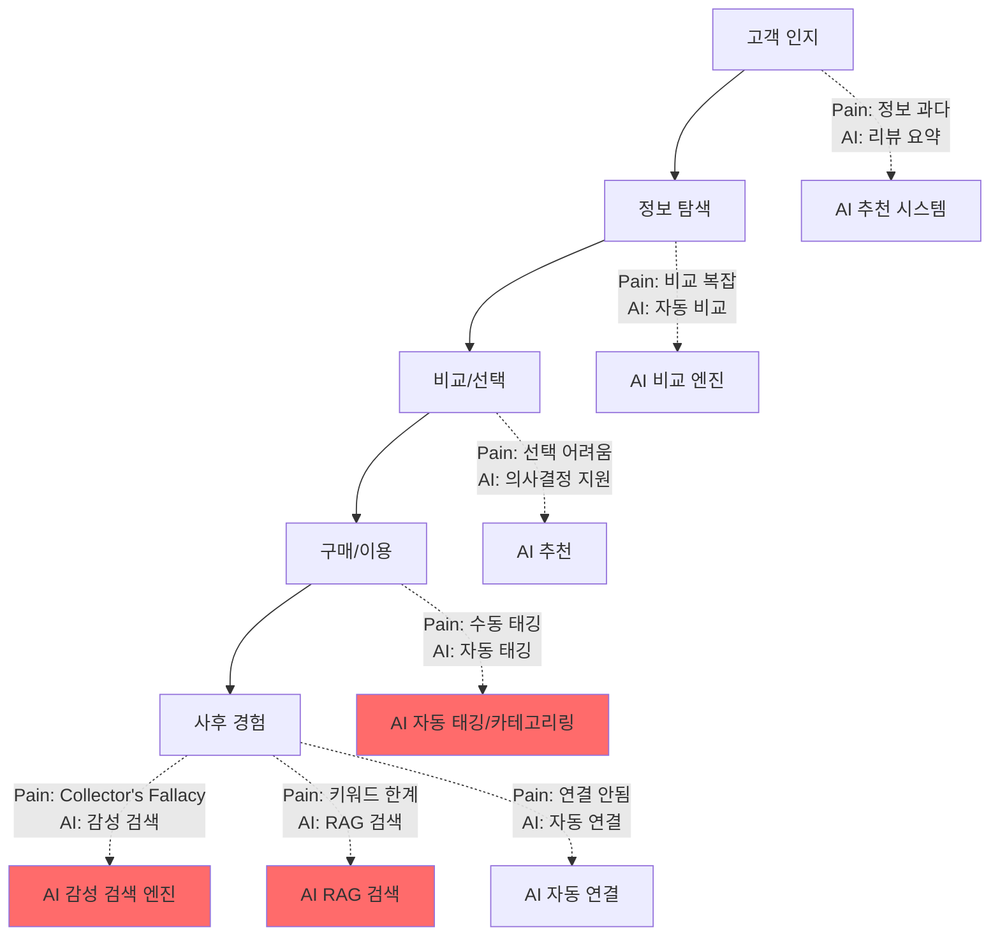

# PHASE 2 - Step 2: Value Chain (가치 사슬) 분석

## 📋 Step 2 개요

**작업일:** 2026-01-10
**상태:** ⏳ 진행 중
**분석 대상 시장:** 웹페이지 클리핑 후 자동 정리 (AI-Powered PKM)
**분석 목적:** 고객의 전체 여정(Value Chain)에서 비효율 지점과 AI 개입 가능 영역 식별

---

## 🎯 Value Chain 분석 프레임워크

Value Chain 분석은 고객이 제품/서비스를 인지하고 구매하며 사용하는 전체 여정을 단계별로 나누어, 각 단계에서 발생하는 Pain Point와 AI 개입 가능 지점을 식별합니다.

---

## 📍 Primary Activities (주요 활동) 매핑

### 1. 고객 인지 (Awareness)

**활동 설명:** 고객이 웹페이지 클리핑 도구의 필요성을 인지하고, 솔루션을 찾기 시작하는 단계

**현재 상태 (As-Is):**
- **트리거:** 웹페이지를 많이 저장하지만 나중에 찾지 못함 (Collector's Fallacy)
- **탐색 방법:** 구글 검색 ("웹페이지 저장 도구", "PKM 도구")
- **정보 소스:** 블로그 리뷰, YouTube, Reddit (r/PKMS), 커뮤니티 추천
- **소요 시간:** 1-3시간 (여러 도구 비교 검색)

**Pain Point:**
| **Pain Point** | **심각도** | **발생 빈도** | **소요 시간/비용** |
|--------------|----------|------------|-----------------|
| 정보 과다 | 높음 | 매번 | 1-3시간 |
| 비교 어려움 | 중간 | 매번 | 30분-1시간 |
| 한국어 리뷰 부족 | 높음 | 한국 사용자 | 추가 검색 시간 1-2시간 |
| 실제 사용 경험 부족 | 중간 | 매번 | 불확실성 증가 |

**AI 개입 가능 지점:**
- ✅ **AI 기반 추천 시스템:** 사용자의 웹 브라우징 패턴 분석 → 맞춤형 도구 추천
- ✅ **AI 리뷰 요약:** 다수의 리뷰를 AI로 요약하여 비교 시간 단축
- ✅ **AI 챗봇:** "나에게 맞는 PKM 도구는?" 질문에 맞춤형 답변

---

### 2. 정보 탐색 (Information Search)

**활동 설명:** 고객이 여러 PKM 도구를 비교하고, 기능과 가격을 검토하는 단계

**현재 상태 (As-Is):**
- **탐색 채널:** 공식 웹사이트, 가격 페이지, 기능 비교표, 무료 체험
- **비교 항목:** 가격, 기능, 통합 가능성, 사용자 리뷰
- **소요 시간:** 2-5시간 (여러 도구 비교)

**Pain Point:**
| **Pain Point** | **심각도** | **발생 빈도** | **소요 시간/비용** |
|--------------|----------|------------|-----------------|
| 기능 비교 복잡 | 높음 | 매번 | 2-3시간 |
| 가격 구조 불명확 | 중간 | 매번 | 30분-1시간 |
| 통합 가능성 확인 어려움 | 높음 | 매번 | 1-2시간 (각 도구별 확인) |
| 무료 체험 제한 | 중간 | 매번 | 기능 제한으로 인한 불확실성 |

**AI 개입 가능 지점:**
- ✅ **AI 비교 엔진:** 사용자의 니즈 입력 → 자동 비교표 생성
- ✅ **AI 가격 최적화 추천:** 사용 패턴 분석 → 최적 플랜 추천
- ✅ **AI 통합 시뮬레이터:** "내 노트 툴과 통합 가능한가?" 시뮬레이션

---

### 3. 비교/선택 (Comparison/Selection)

**활동 설명:** 고객이 여러 대안을 비교하고 최종 선택을 결정하는 단계

**현재 상태 (As-Is):**
- **비교 기준:** 가격, 기능, 사용자 경험, 통합 가능성
- **의사결정 시간:** 1-7일 (고민 기간)
- **결정 요인:** 무료 체험 경험, 커뮤니티 추천, 가격

**Pain Point:**
| **Pain Point** | **심각도** | **발생 빈도** | **소요 시간/비용** |
|--------------|----------|------------|-----------------|
| 선택의 어려움 | 높음 | 매번 | 1-7일 고민 |
| 기존 데이터 마이그레이션 우려 | 높음 | 전환 시 | 불확실성, 두려움 |
| 가격 대비 가치 불명확 | 중간 | 매번 | 구매 후 후회 가능성 |
| 팀 동의 필요 (B2B) | 높음 | B2B 구매 시 | 추가 시간 1-2주 |

**AI 개입 가능 지점:**
- ✅ **AI 의사결정 지원:** 사용자 니즈 분석 → 최적 도구 추천 + 근거 제공
- ✅ **AI 마이그레이션 시뮬레이션:** 기존 데이터 분석 → 마이그레이션 계획 제시
- ✅ **AI ROI 계산기:** 사용 패턴 예측 → 예상 비용 대비 가치 계산

---

### 4. 구매/이용 (Purchase/Usage)

**활동 설명:** 고객이 도구를 구매하고 실제로 사용하기 시작하는 단계

**현재 상태 (As-Is):**
- **구매 프로세스:** 웹사이트 가입 → 결제 → 온보딩
- **온보딩 시간:** 30분-2시간 (튜토리얼, 설정)
- **초기 사용:** 첫 클리핑, 태깅, 카테고리 설정

**Pain Point:**
| **Pain Point** | **심각도** | **발생 빈도** | **소요 시간/비용** |
|--------------|----------|------------|-----------------|
| 온보딩 복잡 | 높음 | 신규 사용자 | 30분-2시간 |
| 수동 태깅/카테고리 설정 | 매우 높음 | 매일 | 10-30분/일 |
| 노트 툴 통합 설정 복잡 | 높음 | 초기 설정 | 1-3시간 |
| 기존 데이터 마이그레이션 | 높음 | 전환 사용자 | 2-5시간 (수동) |

**AI 개입 가능 지점:**
- ✅ **AI 온보딩 어시스턴트:** 사용자 맞춤형 튜토리얼, 단계별 가이드
- ✅ **AI 자동 태깅/카테고리링:** 콘텐츠 분석 → 자동 태그/카테고리 생성 (핵심 차별화)
- ✅ **AI 통합 자동화:** 노트 툴 API 연동 → 자동 동기화 설정
- ✅ **AI 마이그레이션 도구:** 기존 데이터 자동 이전, 중복 제거, 정리

---

### 5. 사후 경험 (Post-Purchase Experience)

**활동 설명:** 고객이 도구를 지속적으로 사용하며 만족도와 재구매 의도를 형성하는 단계

**현재 상태 (As-Is):**
- **일상 사용:** 웹페이지 클리핑 → 저장 → (수동 정리) → 검색
- **사용 빈도:** 주 3-5회 클리핑, 월 1-2회 검색
- **만족도 요인:** 검색 정확도, 재발견 경험, 시간 절감

**Pain Point:**
| **Pain Point** | **심각도** | **발생 빈도** | **소요 시간/비용** |
|--------------|----------|------------|-----------------|
| 저장 후 재사용 안됨 (Collector's Fallacy) | 매우 높음 | 80% 사용자 | 저장한 정보 활용 못함 |
| 키워드 검색 한계 | 높음 | 검색 시마다 | 관련 정보 찾지 못함 |
| 관련 정보 연결 안됨 | 높음 | 매일 | 지식 네트워크 형성 안됨 |
| 정기적 리뷰 부재 | 중간 | 매월 | 저장한 정보 잊어버림 |
| 팀 공유 어려움 (B2B) | 높음 | B2B 사용자 | 수동 공유, 중복 작업 |

**AI 개입 가능 지점:**
- ✅ **AI 감성 검색 엔진:** "비 오던 날의 우울했던 기억"과 닮은 지식 검색 (핵심 보완 사항)
- ✅ **AI RAG 검색:** 의미적 검색으로 키워드 없이도 관련 정보 발견
- ✅ **AI 자동 연결:** 관련 클리핑 자동 연결, 지식 그래프 구축
- ✅ **AI Daily Review:** 저장한 정보를 정기적으로 리뷰하여 재발견
- ✅ **AI 팀 추천:** 팀원의 클리핑을 AI가 분석하여 관련 정보 추천
- ✅ **시맨틱 그래프 시각화:** 지식 간의 관계를 성좌 형태로 시각화하여 재사용 촉진 (신규 보완)

---

## 📍 Support Activities (지원 활동) 파악

### 1. 기술 인프라 (Technology Infrastructure)

**활동 설명:** 서비스를 제공하기 위한 기술적 기반

**현재 상태:**
- **필수 기술:** 웹 스크래핑, AI 모델, 벡터 DB, 클라우드 스토리지
- **비용:** 월 $5K-$15K (사용자 규모에 따라 증가)

**Pain Point:**
| **Pain Point** | **심각도** | **발생 빈도** | **소요 시간/비용** |
|--------------|----------|------------|-----------------|
| AI API 비용 증가 | 높음 | 사용자 증가 시 | 비용 급증 |
| 스크래핑 실패 | 중간 | 일부 사이트 | 사용자 불만 |
| 스토리지 비용 | 중간 | 사용자 증가 시 | 비용 증가 |

**AI 개입 가능 지점:**
- ✅ **Local LLM 전략:** Ollama 활용으로 AI API 비용 절감 및 프라이버시 보호
- ✅ **AI 스크래핑 최적화:** 네이버 블로그, 브런치 등 한국 로컬 사이트 파서 보완 (Localization)
- ✅ **AI 스토리지 최적화:** 중복 제거, 압축 최적화

---

### 2. 인적 자원 (Human Resources)

**활동 설명:** 서비스 개발 및 운영을 위한 인력

**현재 상태:**
- **필수 인력:** 개발자, AI 엔지니어, 디자이너, 고객 지원
- **비용:** 월 $20K-$50K (팀 규모에 따라)

**Pain Point:**
| **Pain Point** | **심각도** | **발생 빈도** | **소요 시간/비용** |
|--------------|----------|------------|-----------------|
| 고객 지원 부담 | 중간 | 사용자 증가 시 | 인력 비용 증가 |
| 버그 리포트 처리 | 중간 | 지속적 | 개발자 시간 소모 |

**AI 개입 가능 지점:**
- ✅ **AI 고객 지원 챗봇:** 자주 묻는 질문 자동 응답
- ✅ **AI 버그 리포트 분석:** 자동 분류 및 우선순위 설정

---

### 3. 공급망 구조 (Supply Chain)

**활동 설명:** 외부 서비스 및 도구와의 연동

**현재 상태:**
- **주요 연동:** 노트 툴 (Obsidian, Notion), 브라우저 확장, API
- **의존도:** 중간-높음 (노트 툴 API 변경 시 영향)

**Pain Point:**
| **Pain Point** | **심각도** | **발생 빈도** | **소요 시간/비용** |
|--------------|----------|------------|-----------------|
| 노트 툴 API 변경 | 중간 | 연 1-2회 | 통합 재구축 필요 |
| 브라우저 업데이트 | 낮음 | 연 1-2회 | 확장 프로그램 수정 |

**AI 개입 가능 지점:**
- ✅ **AI API 모니터링:** 노트 툴 API 변경 자동 감지 및 알림
- ✅ **AI 통합 테스트:** 자동화된 통합 테스트로 변경 사항 빠른 대응

---

## 📊 Value Chain Pain Point 종합 분석표

| **단계** | **Pain Point** | **소요 시간/비용** | **AI 개선 가능 여부** | **우선순위** |
|---------|--------------|-----------------|-------------------|------------|
| **고객 인지** | 정보 과다, 한국어 리뷰 부족 | 1-3시간 | ✅ 가능 | 중간 |
| **정보 탐색** | 기능 비교 복잡, 통합 확인 어려움 | 2-5시간 | ✅ 가능 | 중간 |
| **비교/선택** | 선택의 어려움, 마이그레이션 우려 | 1-7일 | ✅ 가능 | 중간 |
| **구매/이용** | 수동 태깅/카테고리 설정 | 10-30분/일 | ✅ **가능 (핵심)** | **높음** |
| **사후 경험** | Collector's Fallacy, 키워드 검색 한계 | 지속적 | ✅ **가능 (핵심)** | **매우 높음** |

---

## 🎯 AI 개입 가능 지점 우선순위

### 🔴 최우선 (핵심 차별화 포인트)

1. **AI 자동 태깅/카테고리링** (구매/이용 단계)
   - **Pain Point:** 수동 태깅/카테고리 설정 (10-30분/일)
   - **AI 해결책:** 콘텐츠 분석 → 자동 태그/카테고리 생성
   - **예상 효과:** 시간 절감 90%, 사용자 만족도 증가

2. **AI 감성 검색 엔진** (사후 경험 단계)
   - **Pain Point:** Collector's Fallacy, 키워드 검색 한계
   - **AI 해결책:** "비 오던 날의 우울했던 기억"과 닮은 지식 검색
   - **예상 효과:** 저장한 정보 활용률 2배 증가

3. **AI RAG 검색** (사후 경험 단계)
   - **Pain Point:** 키워드 검색으로 관련 정보 찾지 못함
   - **AI 해결책:** 의미적 검색으로 키워드 없이도 관련 정보 발견
   - **예상 효과:** 검색 성공률 50% 증가

### 🟡 중간 우선순위

4. **AI 자동 연결** (사후 경험 단계)
   - **Pain Point:** 관련 정보 연결 안됨
   - **AI 해결책:** 관련 클리핑 자동 연결, 지식 그래프 구축
   - **예상 효과:** 지식 네트워크 형성, 재발견 확률 증가

5. **AI Daily Review** (사후 경험 단계)
   - **Pain Point:** 저장한 정보 잊어버림
   - **AI 해결책:** 정기적으로 저장한 정보 리뷰하여 재발견
   - **예상 효과:** 저장한 정보 활용률 증가

6. **AI 마이그레이션 도구** (구매/이용 단계)
   - **Pain Point:** 기존 데이터 마이그레이션 (2-5시간 수동)
   - **AI 해결책:** 기존 데이터 자동 이전, 중복 제거, 정리
   - **예상 효과:** 마이그레이션 시간 80% 절감

### 🟢 낮은 우선순위

7. **AI 온보딩 어시스턴트** (구매/이용 단계)
8. **AI 비교 엔진** (정보 탐색 단계)
9. **AI 고객 지원 챗봇** (Support Activities)

---

## 📈 Value Chain 다이어그램

---

## 🎯 핵심 인사이트

### 3가지 핵심 발견

1. **가장 큰 Pain Point는 "사후 경험" 단계에 집중**
   - Collector's Fallacy (80% 사용자가 저장 후 재사용 안함)
   - 키워드 검색 한계로 관련 정보 찾지 못함
   - **→ AI 감성 검색 엔진, RAG 검색이 핵심 차별화 포인트**

2. **"구매/이용" 단계의 수동 작업이 사용자 이탈 원인**
   - 수동 태깅/카테고리 설정 (10-30분/일)
   - **→ AI 자동 태깅/카테고리링 및 스마트 온보딩(마이그레이션) 보완 필수**

3. **"고객 인지"부터 "비교/선택"까지의 Pain Point도 AI로 개선 가능**
   - 정보 과다, 비교 복잡, 선택 어려움
   - **→ AI 추천 시스템, 비교 엔진으로 전환율 증가 가능**

### AI 개입 전략

**Phase 1 (MVP):**
- AI 자동 태깅/카테고리링
- AI RAG 검색

**Phase 2 (성장):**
- AI 감성 검색 엔진
- AI 자동 연결

**Phase 3 (확장):**
- AI Daily Review
- AI 팀 추천 (B2B)

---

*문서 생성일: 2026-01-10*
*마지막 업데이트: 2026-01-10*
