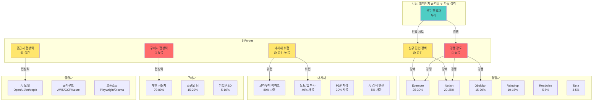
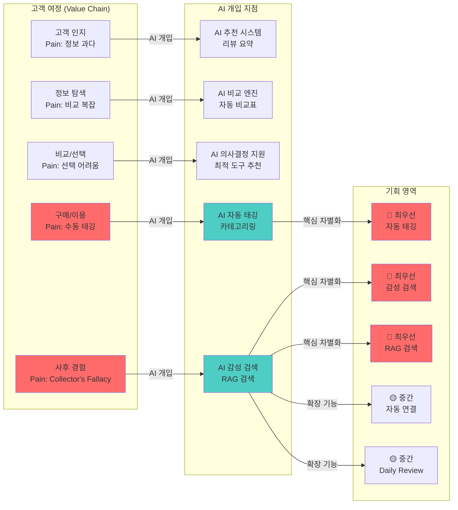
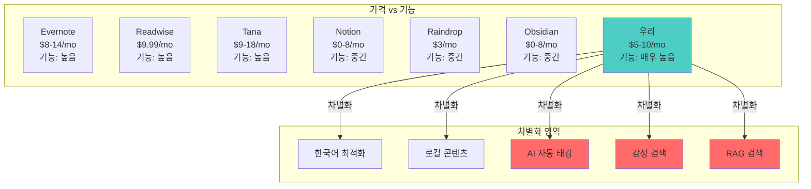
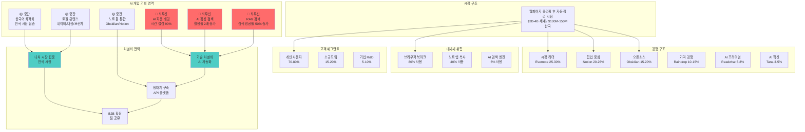
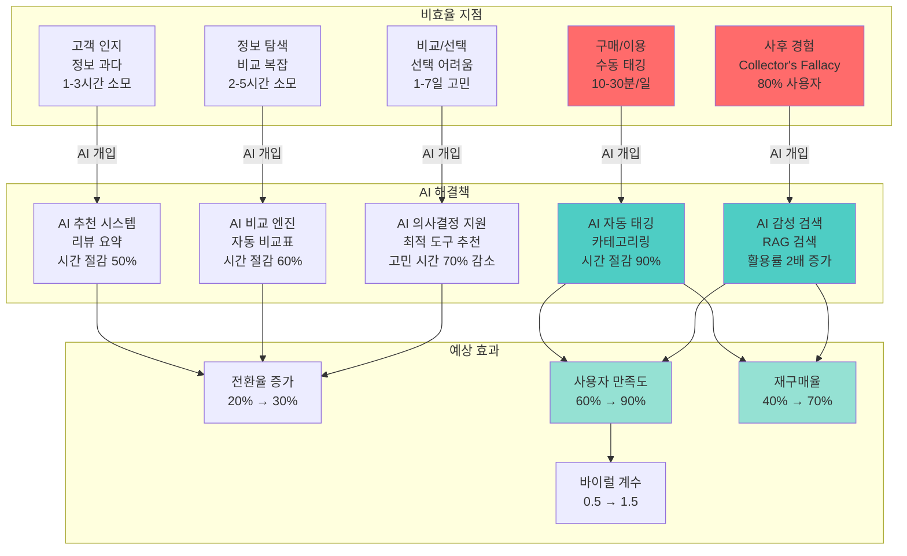
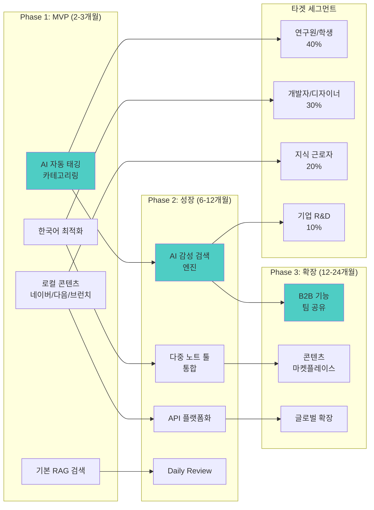

# PHASE 2 - Step 4: 시장 구조 시각화

## 📋 Step 4 개요

**작업일:** 2026-01-10
**상태:** ⏳ 진행 중
**분석 대상 시장:** 웹페이지 클리핑 후 자동 정리 (AI-Powered PKM)
**시각화 목적:** 시장 구조, 경쟁 관계, AI 개입 가능 영역을 다이어그램으로 표현

---

## 🎯 시장 구조 전체 다이어그램

### 1. Porter's 5 Forces 시각화

---

## 2. Value Chain 및 AI 개입 지점 시각화

---

## 3. 경쟁사 포지셔닝 맵

---

## 4. 시장 구조 및 기회 영역 통합 다이어그램

---

## 5. 비효율 지점 및 AI 개입 가능 영역 상세 다이어그램

---

## 6. 시장 진입 전략 시각화

---

## 📊 기회 영역 하이라이트

### 🔴 최우선 기회 영역 (핵심 차별화)

1. **AI 자동 태깅/카테고리링**
   - **비효율 지점:** 수동 태깅/카테고리 설정 (10-30분/일)
   - **AI 개입:** 콘텐츠 분석 → 자동 태그/카테고리 생성
   - **예상 효과:** 시간 절감 90%, 사용자 만족도 증가
   - **경쟁사 대비:** 대부분 수동 태깅 → 차별화 포인트

2. **AI 감성 검색 엔진**
   - **비효율 지점:** Collector's Fallacy (80% 사용자가 저장 후 재사용 안함)
   - **AI 개입:** "비 오던 날의 우울했던 기억"과 닮은 지식 검색
   - **예상 효과:** 저장한 정보 활용률 2배 증가
   - **경쟁사 대비:** 키워드 검색만 제공 → 독보적 차별화

3. **AI RAG 검색**
   - **비효율 지점:** 키워드 검색 한계로 관련 정보 찾지 못함
   - **AI 개입:** 의미적 검색으로 키워드 없이도 관련 정보 발견
   - **예상 효과:** 검색 성공률 50% 증가
   - **경쟁사 대비:** 일부만 제공 → 품질 차별화

### 🟡 중간 우선순위 기회 영역

4. **한국어 최적화 + 로컬 콘텐츠**
   - **비효율 지점:** 한국 사용자의 한국어 콘텐츠 클리핑 및 검색
   - **AI 개입:** 한국어 요약, 토픽 분류 최적화, 로컬 콘텐츠 지원
   - **예상 효과:** 한국 사용자 만족도 증가, 니치 시장 집중
   - **경쟁사 대비:** 대부분 글로벌 중심 → 니치 차별화

5. **다중 노트 툴 통합**
   - **비효율 지점:** 클리핑한 정보를 노트 툴과 통합하는 복잡성
   - **AI 개입:** 자동 통합, API 플랫폼화
   - **예상 효과:** 워크플로우 통합, 사용자 잠금 효과
   - **경쟁사 대비:** 제한적 통합 → 생태계 구축

6. **AI 자동 연결**
   - **비효율 지점:** 관련 정보 연결 안됨, 지식 네트워크 형성 안됨
   - **AI 개입:** 관련 클리핑 자동 연결, 지식 그래프 구축
   - **예상 효과:** 재발견 확률 증가, 지식 네트워크 형성
   - **경쟁사 대비:** 일부만 제공 → 기능 확장

---

## 🎯 시장 구조 핵심 인사이트

### 3가지 핵심 발견

1. **가장 큰 기회는 "사후 경험" 단계에 집중**
   - Collector's Fallacy (80% 사용자)
   - 키워드 검색 한계
   - **→ AI 감성 검색 엔진, RAG 검색이 핵심 차별화 포인트**

2. **"구매/이용" 단계의 수동 작업이 사용자 이탈 원인**
   - 수동 태깅/카테고리 설정 (10-30분/일)
   - **→ AI 자동 태깅/카테고리링이 필수 기능**

3. **니치 시장 집중 전략으로 차별화 가능**
   - 한국어 최적화, 로컬 콘텐츠 지원
   - **→ 한국 시장 집중으로 초기 진입 용이**

### AI 개입 전략 요약

**Phase 1 (MVP):**
- AI 자동 태깅/카테고리링
- 한국어 최적화
- 로컬 콘텐츠 지원
- 기본 RAG 검색

**Phase 2 (성장):**
- AI 감성 검색 엔진
- 다중 노트 툴 통합
- API 플랫폼화
- Daily Review

**Phase 3 (확장):**
- B2B 기능 (팀 공유)
- 콘텐츠 마켓플레이스
- 글로벌 확장

---

*문서 생성일: 2026-01-10*
*마지막 업데이트: 2026-01-10*
