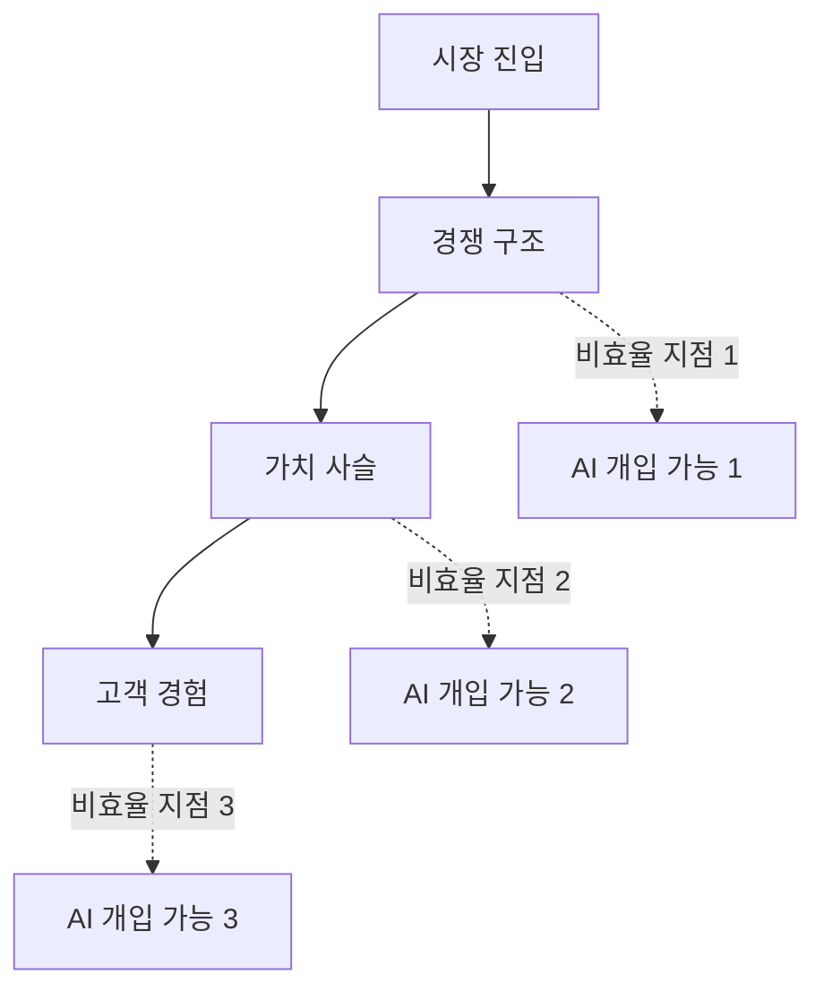

# PHASE 2: AI 기반 시장 구조 분석

## 📋 섹션 개요

이 문서는 **시장 구조 분석** 단계의 결과물을 담고 있습니다.

| 섹션 | 파일명 | 상태 |
|-------|--------|------|
| Step 1: Porter's 5 Forces 분석 | `PHASE2-Step1-Porters5Forces-YYYY-MM-DD.md` | ⏳ 준비 중 |
| Step 2: Value Chain 분석 | `PHASE2-Step2-ValueChain-YYYY-MM-DD.md` | ⏳ 준비 중 |
| Step 3: 대체재 및 경쟁사 매핑 | `PHASE2-Step3-대체재경쟁사-YYYY-MM-DD.md` | ⏳ 준비 중 |
| Step 4: 시장 구조 시각화 | `PHASE2-Step4-시장구조시각화-YYYY-MM-DD.md` | ⏳ 준비 중 |
| Step 5: 종합 분석 및 기회 도출 | `PHASE2-Step5-종합분석-YYYY-MM-DD.md` | ⏳ 준비 중 |

---

## 🎯 PHASE 2 목표

| **목표** | 선정한 시장의 경쟁 구조와 가치 사슬을 파악하기 |
| --- | --- |
| **AI 활용** | ·Porter's 5 Forces 분석 AI<br/>·Value Chain Pain Point 분석 AI<br/>·경쟁사 비교 AI |
| **산출물** | ·시장 구조도<br/>·비효율 발생 지점<br/>·AI 개입 가능 영역 |
| **평가 포인트** | "어디에 끼어들 수 있는가?" |

---

## 📍 Step 1: Porter's 5 Forces 분석

### 신규 진입 장벽 분석
- [ ] 기존 플레이어:
- [ ] 필요 자본:
- [ ] 규제 요건:

### 대체재 위협 평가
- [ ] 고객이 현재 사용 중인 대안:
- [ ] 대체재 위협 수준 (High/Medium/Low):

### 구매자 협상력 분석
- [ ] 고객의 전환 비용:
- [ ] 선택권:

### 공급자 협상력 분석
- [ ] 핵심 자원 의존도:
- [ ] 공급자 교체 가능성:

### 경쟁 강도 평가
- [ ] 시장 집중도:
- [ ] 차별화 가능성:

### Porter's 5 Forces 분석표

| **요소** | **상태** | **근거** | **신규 진입자에게** |
| --- | --- | --- | --- |
| 신규 진입 장벽 | | | 유리/불리 이유 |
| 대체재 위협 | | | 유리/불리 이유 |
| 구매자 협상력 | | | 유리/불리 이유 |
| 공급자 협상력 | | | 유리/불리 이유 |
| 경쟁 강도 | | | 유리/불리 이유 |

---

## 📍 Step 2: Value Chain (가치 사슬) 분석

### Primary Activities 매핑
- [ ] 고객 인지
- [ ] 정보 탐색
- [ ] 비교/선택
- [ ] 구매/이용
- [ ] 사후 경험

### Support Activities 파악
- [ ] 기술 인프라
- [ ] 인적 자원
- [ ] 공급망 구조

### 각 단계별 Pain Point 식별

| **단계** | **Pain Point** | **소요 시간/비용** | **AI 개선 가능 여부** |
| --- | --- | --- | --- |
| 고객 인지 | | | |
| 정보 탐색 | | | |
| 비교/선택 | | | |
| 구매/이용 | | | |
| 사후 경험 | | | |

### AI 개입 가능 지점 표시

```
비효율 지점 → AI 해결책
```

---

## 📍 Step 3: 대체재 및 경쟁사 매핑

### 직접 경쟁사 리스트업

| **경쟁사** | **주요 제품/서비스** | **시장 점유율** |
| --- | --- | --- |
| | | |
| | | |
| | | |

### 간접 대체재 발굴

| **대체재** | **사용 방법** | **왜 사용하는가?** |
| --- | --- | --- |
| | | |
| | | |

### 각 대안의 장단점 분석

| **대안** | **장점** | **단점** | **가격** | **편의성** | **효과성** |
| --- | --- | --- | --- | --- | --- |
| | | | | | |

### 차별화 포인트 도출

```
기존 대안들이 해결하지 못하는 영역:
```

---

## 📍 Step 4: 시장 구조 시각화

### Mermaid 다이어그램



### 기회 영역 하이라이트

```
비효율 지점과 AI 개입 가능 영역 표시
```

---

## 📍 Step 5: 종합 분석 및 기회 도출

### 3가지 핵심 발견 정리
1. 
2. 
3. 

### 2가지 주요 기회 명시
1. 
2. 

### 1가지 리스크 요인 식별
```
주의해야 할 시장 장벽 또는 경쟁 요소:
```

---

## 🎯 PHASE 2 완료 체크포인트

- [ ] 시장의 경쟁 구조를 5 Forces 관점에서 설명할 수 있는가?
- [ ] 고객의 전체 여정(Value Chain)에서 비효율 지점을 3개 이상 식별했는가?
- [ ] 기존 대안들의 한계를 명확히 파악했는가?
- [ ] AI가 개입할 수 있는 구체적 지점을 2개 이상 발견했는가?
- [ ] 분석 결과를 다이어그램으로 시각화했는가?

---

## 📌 산출물 요약

| **산출물** | **내용** | **위치** |
| --- | --- | --- |
| Porter's 5 Forces 분석표 | Step 1 참조 | Step 1 |
| Value Chain 다이어그램 | 단계별 Pain Point 포함 | Step 2 |
| 대체재 비교표 | Step 3 참조 | Step 3 |
| 시장 구조 시각화 | Mermaid 다이어그램 | Step 4 |
| 핵심 인사이트 요약 | 기회 2개 + 리스크 1개 | Step 5 |

---

*문서 생성일: YYYY-MM-DD*
*마지막 업데이트: YYYY-MM-DD*
