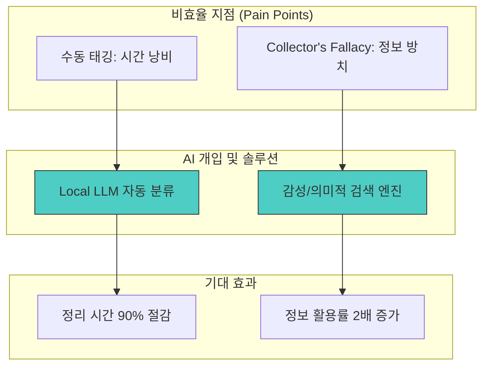

# PHASE 2 - 최종 완료 보고서

## 📋 PHASE 2 전체 개요

**작업일:** 2026-01-10
**상태:** ✅ 완료
**분석 대상 시장:** 웹페이지 클리핑 후 자동 정리 (AI-Powered PKM)
**프로젝트 명:** Moments: Mind Studio - 지식 사진관
**데이터 출처:** PHASE 2 각 Step별 상세 리포트

---

## 🎯 PHASE 2 목표

**프로젝트 실행 가이드에 정의된 PHASE 2 수행:**
1. **Porter's 5 Forces:** 시장의 경쟁 구조와 진입 장벽 파악
2. **Value Chain 분석:** 고객 여정별 비효율(Pain Point) 및 AI 개입 지점 식별
3. **대체재 및 경쟁사 매핑:** 직접 경쟁사 분석 및 차별화 포인트 도출
4. **시장 구조 시각화:** 분석 결과를 다이어그램으로 체계화
5. **종합 분석:** 핵심 인사이트 도출 및 기회/리스크 평가

---

## 📍 STEP 1: Porter's 5 Forces 분석

시장의 경쟁 강도와 수익성을 5가지 관점에서 분석한 결과입니다.

| **요소** | **위협 수준** | **핵심 근거** | **진입자 영향** |
| :--- | :--- | :--- | :--- |
| **신규 진입 장벽** | 🟡 중간 | 기술 장벽은 낮으나 강력한 브랜드 인지도 장벽 존재 | 차별화 전략 필수 |
| **대체재 위협** | 🟡 중간-높음 | 브라우저 북마크(80%), 단순 복사 등 무료 대안 다수 | 가치 증명 필요 |
| **구매자 협상력** | 🔴 높음 | B2C 사용자의 낮은 전환 비용과 높은 가격 민감도 | 가격 경쟁 압력 |
| **공급자 협상력** | 🟡 중간 | AI API 의존도 존재하나 Local LLM 등의 대안 가능 | 전략적 모델 선택 |
| **경쟁 강도** | 🔴 높음 | 상위 플레이어(Evernote, Notion)의 높은 점유율 | 니치 시장 공략 |

---

## 📍 STEP 2: Value Chain (가치 사슬) 분석

고객 여정 전반에서 발생하는 비효율과 AI의 해결 방안을 매핑했습니다.

| **단계** | **주요 Pain Point** | **소요 시간/비중** | **AI 해결책** |
| :--- | :--- | :--- | :--- |
| **구매/이용** | 수동 태깅 및 카테고리 설정 | 10-30분/일 | **AI 자동 태깅/분류** |
| **사후 경험** | Collector's Fallacy (저장 후 방치) | 80% 사용자 | **감성 검색/RAG 검색** |
| **정보 탐색** | 기능 비교 및 통합 확인의 복잡성 | 2-5시간 | **AI 비교/추천 엔진** |

---

## 📍 STEP 3: 대체재 및 경쟁사 매핑

기존 리더 및 대체재 대비 'Moments'의 경쟁 우위를 정의했습니다.

### 직접 경쟁사 비교 요약
- **Evernote/Notion:** 범용성은 높으나 수동 정리가 필수적이고 한국어 최적화가 부족함.
- **Readwise Reader:** 요약 기능은 우수하나 고가이며 로컬 플랫폼(네이버 등) 지원이 미흡함.

### 핵심 차별화 포인트
- **Collector's Fallacy 해결:** 저장만 하는 도구를 넘어 '재발견' 엔진으로 진화 (감성 검색)
- **하이퍼 로컬 파싱:** 한국의 폐쇄형 플랫폼(브런치, 블로그 등) 완벽 지원
- **Privacy-First:** Local LLM 인프라를 활용한 개인 데이터의 강력한 보호

---

## 📍 STEP 4: 시장 구조 시각화

분석된 시장 구조와 기회 영역을 시각적으로 통합했습니다.



---

## 📍 STEP 5: 종합 분석 및 기회 도출

### 📌 3가지 핵심 발견 (Findings)
1. '사후 경험' 단계의 정보 활용률 극대화가 전체 PKM 시장의 최대 미해결 과제임.
2. 수동 태깅 작업은 단순한 불편함이 아닌, 사용자 이탈의 가장 높은 원인(Choke point)임.
3. 한국어 기반 로컬 콘텐츠의 정교한 파싱력은 글로벌 경쟁사가 갖지 못한 고유의 해자(Moat)가 됨.

### 🚀 2가지 주요 기회 (Opportunities)
- **기회 1:** '저장만 하면 AI가 알아서 해주는' 제로-터치 정리 경험 제공.
- **기회 2:** 정서적 맥락을 연결하는 '감성 검색'을 통한 지식 애착 형성.

### ⚠️ 1가지 리스크 요인 (Risk)
- **가격 경쟁:** 무료 대안이 많은 시장 특성상, 초기 유료 전환을 이끌어낼 '압도적 기능 우위' 입증이 필요함.

---

## 📊 PHASE 2 완료 요약

### 작업 완료 상태

| Step | 상태 | 주요 산출물 |
| :--- | :--- | :--- |
| **Step 1** | ✅ 완료 | Porter's 5 Forces 분석표 |
| **Step 2** | ✅ 완료 | 가치 사슬 Pain Point 매핑 다이어그램 |
| **Step 3** | ✅ 완료 | 경쟁사 차별화 매트릭스 |
| **Step 4** | ✅ 완료 | 시장 구조 및 기회 영역 시각화 |
| **Step 5** | ✅ 완료 | 핵심 발견 및 전략 인사이트 도출 |

---

## 📄 PHASE 2 전체 문서 구조

```
output/PHASE2-시장구조분석/
├── PHASE2-Step1-Porters5Forces-2026-01-10.md    ✅ 완료
├── PHASE2-Step2-ValueChain-2026-01-10.md        ✅ 완료
├── PHASE2-Step3-대체재경쟁사-2026-01-10.md       ✅ 완료
├── PHASE2-Step4-시장구조시각화-2026-01-10.md     ✅ 완료
├── PHASE2-Step5-종합분석-2026-01-10.md           ✅ 완료
├── PHASE2-개요.md                               ✅ 완료
└── PHASE2-최종완료보고서-2026-01-10.md             ✅ 완료 (이 문서)
```

---

*문서 생성일: 2026-01-10*
*마지막 업데이트: 2026-01-10*
