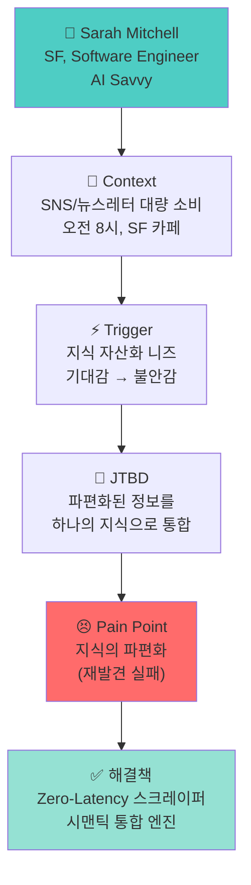
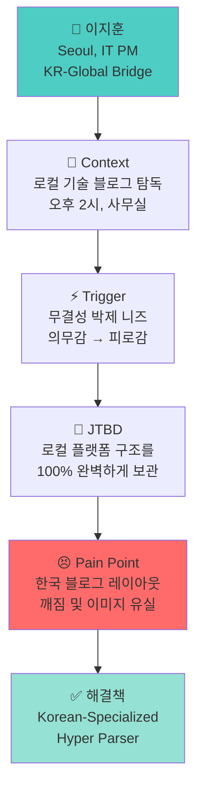
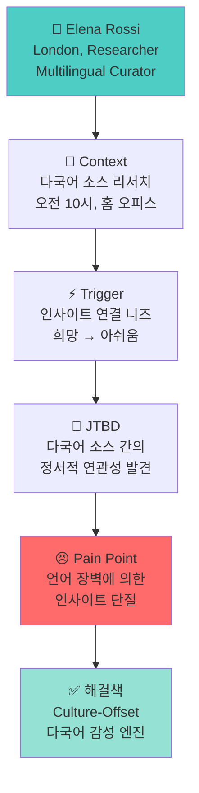
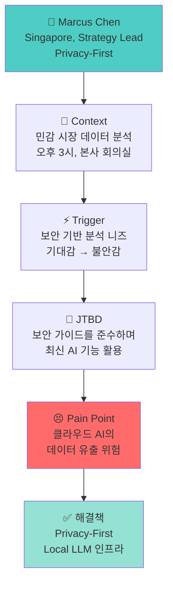
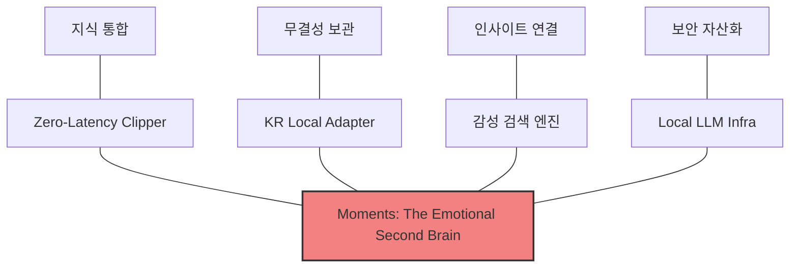

# PHASE 3 - Step 5: 페르소나-JTBD 통합 다이어그램

## 📋 Step 5 개요

**작업일:** 2026-01-10
**상태:** ✅ 완료
**분석 대상:** 4개 글로벌 페르소나별 페르소나-JTBD 통합 다이어그램
**시각화 목적:** 페르소나 → Context → Trigger → JTBD → Pain Points 흐름의 인과 관계 명확화

---

## 👤 페르소나 1: Sarah Mitchell (Global AI Savvy)

---

## 👤 페르소나 2: 이지훈 (Hyper-Local Champion)

---

## 👤 페르소나 3: Elena Rossi (Multilingual Researcher)

---

## 👤 페르소나 4: Marcus Chen (Enterprise Strategist)

---

## 📊 전체 전략 통합 다이어그램

---

*문서 생성일: 2026-01-10*
*마지막 업데이트: 2026-01-10*
