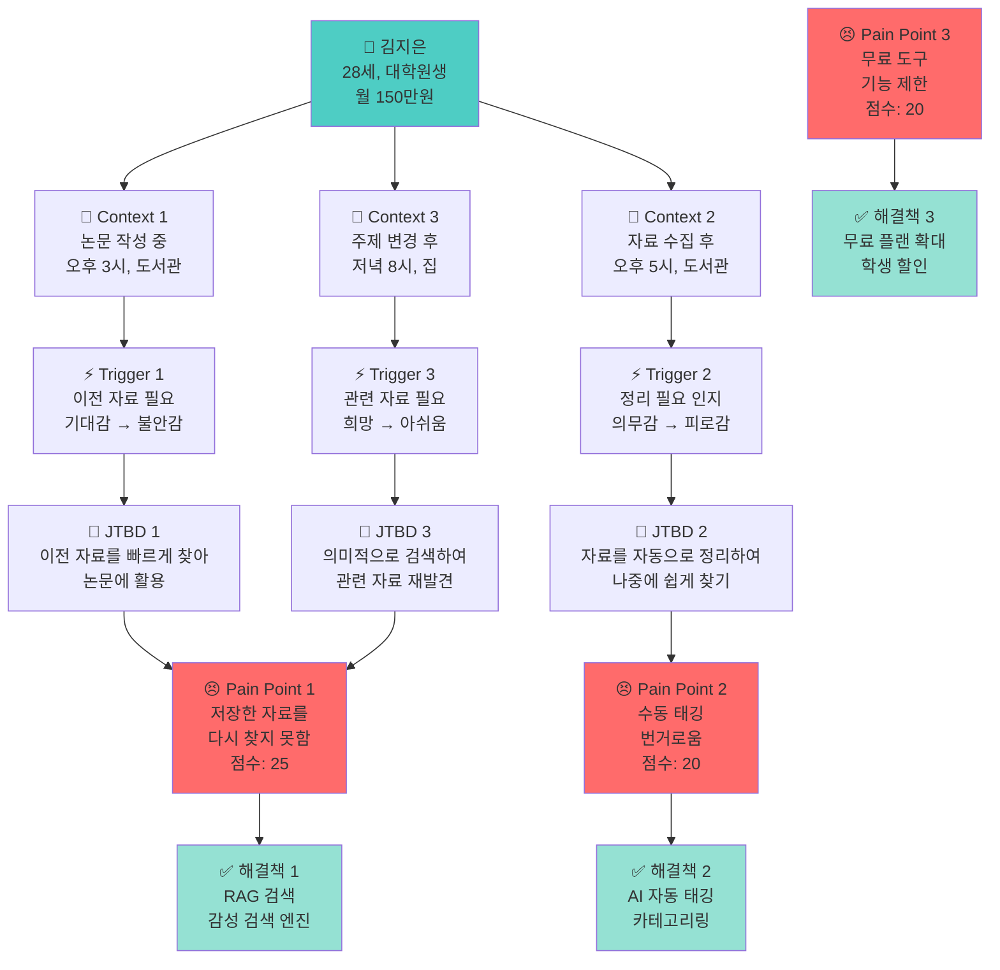
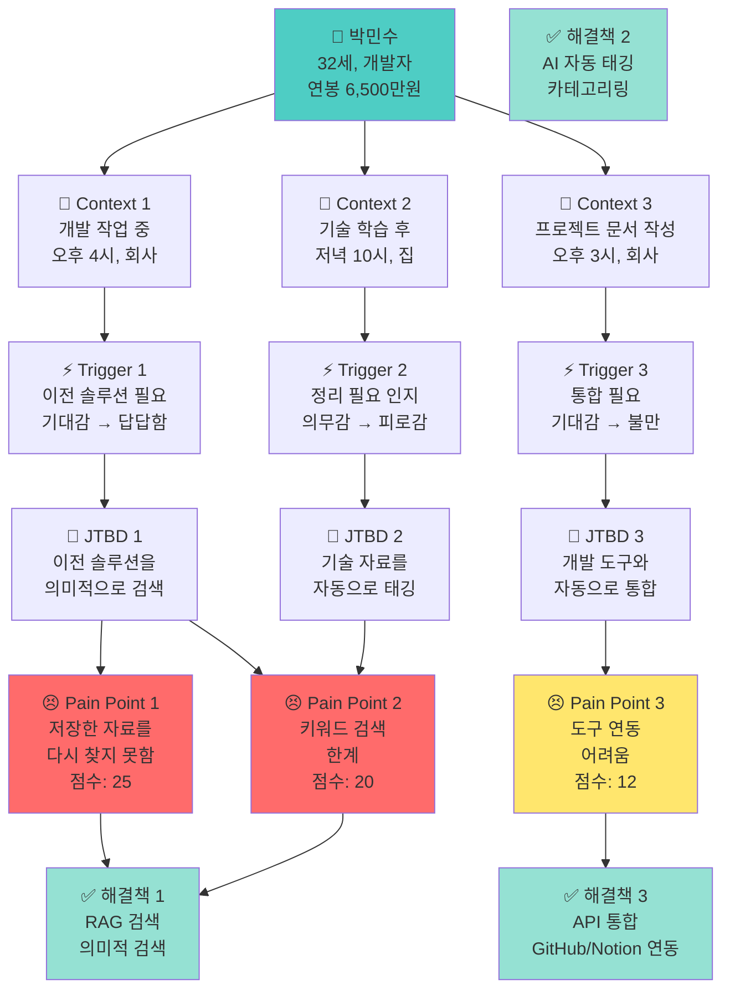
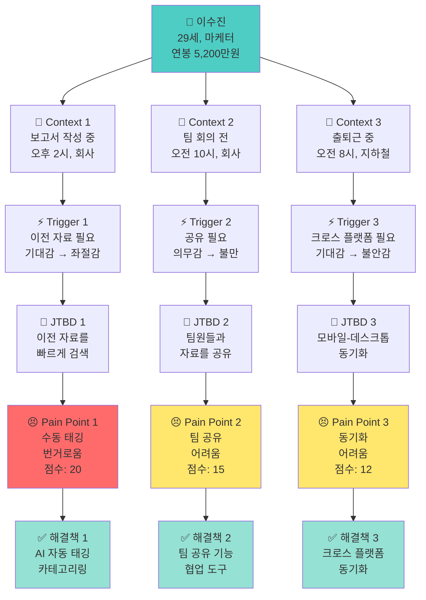
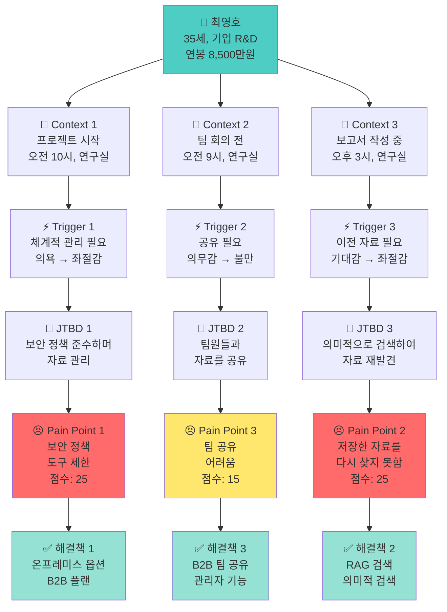
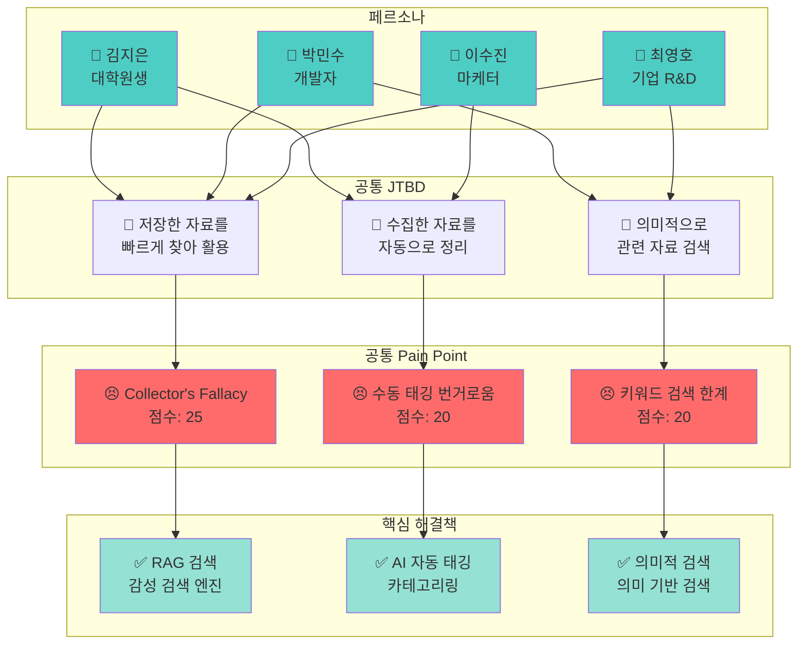
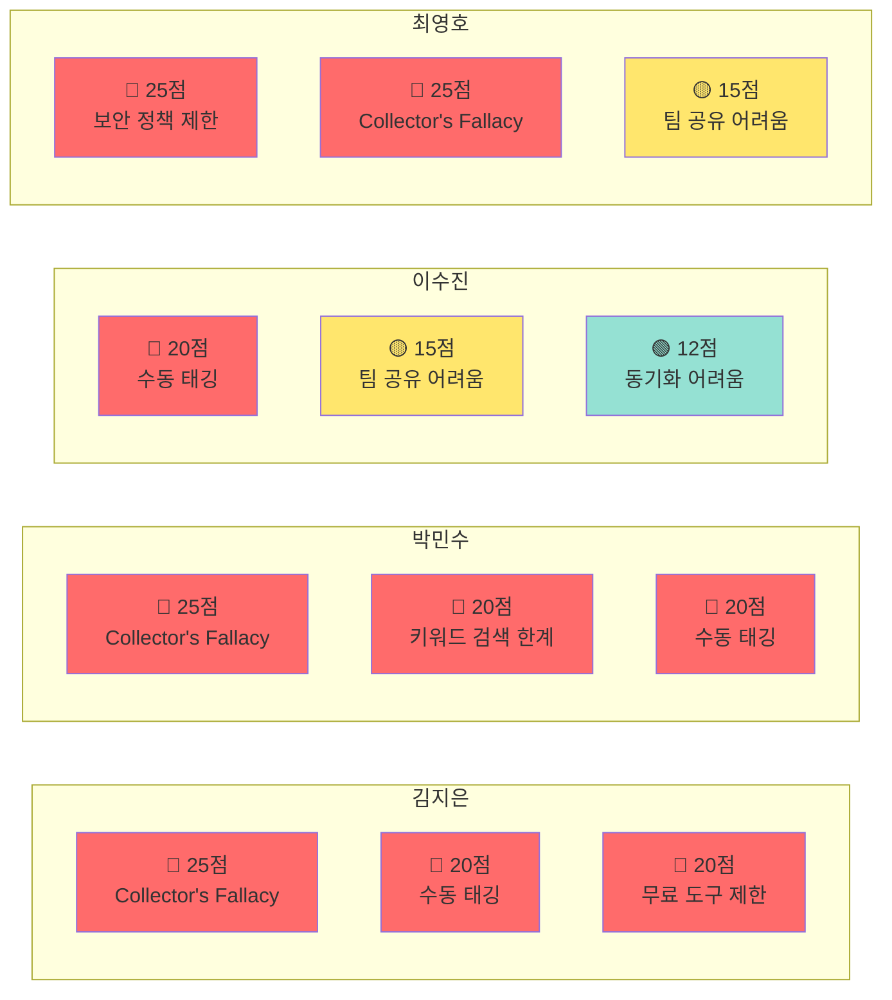

# PHASE 3 - Step 5: 페르소나-JTBD 통합 다이어그램

## 📋 Step 5 개요

**작업일:** 2026-01-10
**상태:** ⏳ 진행 중
**분석 대상:** 4개 페르소나별 페르소나-JTBD 통합 다이어그램
**시각화 목적:** 페르소나 → Context → Trigger → JTBD → Pain Points 흐름을 다이어그램으로 표현

**참고 자료:**
- PHASE 3 Step 1: 페르소나 설계 결과
- PHASE 3 Step 2: Context-Trigger-JTBD 매핑 결과
- PHASE 3 Step 3: AI 롤플레이 심층 검증 결과
- PHASE 3 Step 4: Pain Point 우선순위 매트릭스 결과

---

## 🎯 통합 다이어그램 목적

1. **페르소나-JTBD 연결:** 각 페르소나의 상황과 니즈를 시각적으로 표현
2. **인과 관계 명확화:** Context → Trigger → JTBD → Pain Points의 인과 관계 표시
3. **우선순위 시각화:** 중요도에 따라 색상/굵기 차별화
4. **해결책 매핑:** 각 Pain Point에 대한 해결책 표시

---

## 👤 페르소나 1: 김지은 (대학원생/연구원)

### 페르소나-JTBD 통합 다이어그램

### 연결 고리 명확화

| **연결** | **인과 관계** |
|---------|------------|
| **페르소나 → Context** | 김지은의 일상 상황 (논문 작성, 자료 수집, 주제 변경) |
| **Context → Trigger** | 상황에서 문제 인식 (이전 자료 필요, 정리 필요, 관련 자료 필요) |
| **Trigger → JTBD** | 문제 해결을 위한 목적 형성 (빠른 검색, 자동 정리, 의미적 검색) |
| **JTBD → Pain Points** | 목적 달성 시도 중 실패 지점 (찾지 못함, 번거로움, 기능 제한) |
| **Pain Points → 해결책** | Pain Point 해결을 위한 기능 (RAG 검색, AI 자동 태깅, 무료 플랜) |

---

## 👤 페르소나 2: 박민수 (개발자)

### 페르소나-JTBD 통합 다이어그램

### 연결 고리 명확화

| **연결** | **인과 관계** |
|---------|------------|
| **페르소나 → Context** | 박민수의 일상 상황 (개발 작업, 기술 학습, 문서 작성) |
| **Context → Trigger** | 상황에서 문제 인식 (이전 솔루션 필요, 정리 필요, 통합 필요) |
| **Trigger → JTBD** | 문제 해결을 위한 목적 형성 (의미적 검색, 자동 태깅, 자동 통합) |
| **JTBD → Pain Points** | 목적 달성 시도 중 실패 지점 (찾지 못함, 키워드 한계, 연동 어려움) |
| **Pain Points → 해결책** | Pain Point 해결을 위한 기능 (RAG 검색, AI 자동 태깅, API 통합) |

---

## 👤 페르소나 3: 이수진 (마케터/기획자)

### 페르소나-JTBD 통합 다이어그램

### 연결 고리 명확화

| **연결** | **인과 관계** |
|---------|------------|
| **페르소나 → Context** | 이수진의 일상 상황 (보고서 작성, 팀 회의, 출퇴근) |
| **Context → Trigger** | 상황에서 문제 인식 (이전 자료 필요, 공유 필요, 동기화 필요) |
| **Trigger → JTBD** | 문제 해결을 위한 목적 형성 (빠른 검색, 팀 공유, 동기화) |
| **JTBD → Pain Points** | 목적 달성 시도 중 실패 지점 (번거로움, 공유 어려움, 동기화 어려움) |
| **Pain Points → 해결책** | Pain Point 해결을 위한 기능 (AI 자동 태깅, 팀 공유, 동기화) |

---

## 👤 페르소나 4: 최영호 (기업 R&D 연구원)

### 페르소나-JTBD 통합 다이어그램

### 연결 고리 명확화

| **연결** | **인과 관계** |
|---------|------------|
| **페르소나 → Context** | 최영호의 일상 상황 (프로젝트 시작, 팀 회의, 보고서 작성) |
| **Context → Trigger** | 상황에서 문제 인식 (체계적 관리 필요, 공유 필요, 이전 자료 필요) |
| **Trigger → JTBD** | 문제 해결을 위한 목적 형성 (보안 준수, 팀 공유, 의미적 검색) |
| **JTBD → Pain Points** | 목적 달성 시도 중 실패 지점 (도구 제한, 찾지 못함, 공유 어려움) |
| **Pain Points → 해결책** | Pain Point 해결을 위한 기능 (온프레미스, RAG 검색, B2B 기능) |

---

## 📊 전체 페르소나 통합 다이어그램

### 페르소나-JTBD-Pain Point 통합 흐름

---

## 🎯 우선순위 시각화

### 우선순위별 색상 구분

| **우선순위** | **색상** | **점수 범위** | **Pain Point 수** |
|------------|---------|------------|----------------|
| **최우선** | 🔴 빨간색 | 20점 이상 | 5개 |
| **높은** | 🟡 노란색 | 15-19점 | 1개 |
| **중간** | 🟢 초록색 | 10-14점 | 4개 |

### 페르소나별 우선순위 분포

---

## 📌 핵심 인사이트 요약

### 니즈 Top 3 (모든 페르소나 공통)

1. **"저장한 자료를 의미적으로 검색하여 재발견하고 싶다"**
   - Pain Point: Collector's Fallacy (25점)
   - 해결책: RAG 검색, 감성 검색 엔진
   - 영향받는 페르소나: 김지은, 박민수, 최영호

2. **"수집한 자료를 자동으로 태깅하고 카테고리화하고 싶다"**
   - Pain Point: 수동 태깅 번거로움 (20점)
   - 해결책: AI 자동 태깅/카테고리링
   - 영향받는 페르소나: 김지은, 박민수, 이수진

3. **"키워드가 아닌 의미적으로 관련 자료를 검색하고 싶다"**
   - Pain Point: 키워드 검색 한계 (20점)
   - 해결책: RAG 검색, 의미적 검색
   - 영향받는 페르소나: 박민수, 최영호

### 감정 키워드

**공통 감정 여정:**
1. **초기:** 기대감, 의욕 ("찾으면 활용할 수 있을 것 같아")
2. **중간:** 불안감, 답답함 ("어디에 저장했지?")
3. **후기:** 좌절감, 포기 ("찾지 못하겠다, 시간 낭비했다")

**→ 이 감정 여정을 개선하는 것이 우리의 목표**

### 페르소나별 차별화 니즈

1. **김지은 (대학원생):** 무료/저가 플랜
2. **박민수 (개발자):** API 통합, GitHub/Notion 연동
3. **이수진 (마케터):** 팀 공유 기능, Notion 연동
4. **최영호 (기업 R&D):** B2B 기능, 온프레미스 옵션

---

## 🎯 Phase별 해결 전략

### Phase 1 (MVP) - 공통 니즈 해결

**타겟 Pain Point:**
- Collector's Fallacy (25점)
- 수동 태깅 번거로움 (20점)
- 키워드 검색 한계 (20점)

**핵심 기능:**
- AI 자동 태깅/카테고리링
- RAG 검색 (의미적 검색)
- 기본 노트 툴 통합

**타겟 페르소나:**
- 김지은 (무료 플랜)
- 박민수 (API 통합)

### Phase 2 (성장) - 협업 니즈 해결

**타겟 Pain Point:**
- 팀 공유 어려움 (15점)
- 도구 연동 어려움 (12점)

**핵심 기능:**
- 팀 공유 기능
- Notion 연동 강화
- 모바일-데스크톱 동기화

**타겟 페르소나:**
- 이수진 (마케터)

### Phase 3 (확장) - B2B 니즈 해결

**타겟 Pain Point:**
- 기업 보안 정책 제한 (25점)
- 팀 공유 어려움 (B2B) (15점)

**핵심 기능:**
- B2B 플랜 (팀 공유, 관리자 기능)
- 온프레미스 옵션
- SSO, 보안 인증

**타겟 페르소나:**
- 최영호 (기업 R&D)

---

*문서 생성일: 2026-01-10*
*마지막 업데이트: 2026-01-10*
