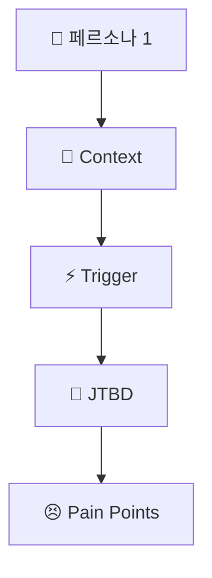

# PHASE 3: 페르소나 & JTBD 설계

## 📋 섹션 개요

이 문서는 **페르소나 & JTBD 설계** 단계의 결과물을 담고 있습니다.

| 섹션 | 파일명 | 상태 |
|-------|--------|------|
| Step 1: 페르소나 설계 (3~5개) | `PHASE3-Step1-페르소나설계-YYYY-MM-DD.md` | ⏳ 준비 중 |
| Step 2: Context-Trigger-JTBD 매핑 | `PHASE3-Step2-ContextTriggerJTBD-YYYY-MM-DD.md` | ⏳ 준비 중 |
| Step 3: AI 롤플레이 심층 검증 | `PHASE3-Step3-AI롤플레이-YYYY-MM-DD.md` | ⏳ 준비 중 |
| Step 4: Pain Point 우선순위 매트릭스 | `PHASE3-Step4-PainPoint우선순위-YYYY-MM-DD.md` | ⏳ 준비 중 |
| Step 5: 페르소나-JTBD 통합 다이어그램 | `PHASE3-Step5-통합다이어그램-YYYY-MM-DD.md` | ⏳ 준비 중 |

---

## 🎯 PHASE 3 목표

**핵심 원칙:** "누가 쓸까?"가 아닌 **"누가 언제 왜 필요한가?"**를 명확히 정의

| **구성 요소** | **설명** | **AI 활용** |
| --- | --- | --- |
| 페르소나 | 3~5개, 인구통계+행동 패턴 | 통계 기반 프로필 생성 |
| Context | 문제가 발생하는 상황 | 시나리오 시뮬레이션 |
| Trigger | 행동을 일으키는 계기 | 이벤트 패턴 분석 |
| JTBD | 해결하려는 근본 목적 | Jobs-to-be-Done 구조화 |
| Pain Points | 현재 해결책의 실패 지점 | 감정 맵핑 |

---

## 📍 Step 1: 페르소나 설계 (3~5개)

### 페르소나 1: [이름]

#### 인구통계 정보 설정
- **이름:** 
- **나이:** 
- **직업:** 
- **소득 수준:** 
- **거주 지역:** 

#### 행동 패턴 분석
- **하루 일과:** 
- **의사결정 방식:** 
- **기술 활용 수준 (디지털 친숙도):** 

#### 목표와 동기 파악
- **궁극적으로 달성하고자 하는 것:** 

#### 좌절 요인 식별
- **현재 겪고 있는 구체적인 불편과 문제 1:** 
- **현재 겪고 있는 구체적인 불편과 문제 2:** 
- **현재 겪고 있는 구체적인 불편과 문제 3:** 

### 페르소나 2: [이름]

#### 인구통계 정보 설정
- **이름:** 
- **나이:** 
- **직업:** 
- **소득 수준:** 
- **거주 지역:** 

#### 행동 패턴 분석
- **하루 일과:** 
- **의사결정 방식:** 
- **기술 활용 수준 (디지털 친숙도):** 

#### 목표와 동기 파악
- **궁극적으로 달성하고자 하는 것:** 

#### 좌절 요인 식별
- **현재 겪고 있는 구체적인 불편과 문제 1:** 
- **현재 겪고 있는 구체적인 불편과 문제 2:** 
- **현재 겪고 있는 구체적인 불편과 문제 3:** 

### 페르소나 3: [이름]

#### 인구통계 정보 설정
- **이름:** 
- **나이:** 
- **직업:** 
- **소득 수준:** 
- **거주 지역:** 

#### 행동 패턴 분석
- **하루 일과:** 
- **의사결정 방식:** 
- **기술 활용 수준 (디지털 친숙도):** 

#### 목표와 동기 파악
- **궁극적으로 달성하고자 하는 것:** 

#### 좌절 요인 식별
- **현재 겪고 있는 구체적인 불편과 문제 1:** 
- **현재 겪고 있는 구체적인 불편과 문제 2:** 
- **현재 겪고 있는 구체적인 불편과 문제 3:** 

---

## 📍 Step 2: Context-Trigger-JTBD 매핑

### 페르소나 1: [이름]

#### 시나리오 1

**Context (맥락):**
- **언제:** [시간/요일/상황]
- **어디서:** [장소/환경]
- **무엇 때문에:** [선행 조건]

**촉발 요인(Trigger):**
- **즉각적 계기:** [구체적 이벤트]
- **감정 상태:** [느끼는 감정]

**Job-to-be-Done:**
"나는 [Context]에서 [최종 목적]을 달성하기 위해 [해결책]을 찾고 있습니다."

**현재 대안의 한계:**
- 시도해본 방법들과 그것들이 실패한 이유:

#### 시나리오 2

**Context (맥락):**
- **언제:** [시간/요일/상황]
- **어디서:** [장소/환경]
- **무엇 때문에:** [선행 조건]

**촉발 요인(Trigger):**
- **즉각적 계기:** [구체적 이벤트]
- **감정 상태:** [느끼는 감정]

**Job-to-be-Done:**
"나는 [Context]에서 [최종 목적]을 달성하기 위해 [해결책]을 찾고 있습니다."

**현재 대안의 한계:**
- 시도해본 방법들과 그것들이 실패한 이유:

#### 시나리오 3

**Context (맥락):**
- **언제:** [시간/요일/상황]
- **어디서:** [장소/환경]
- **무엇 때문에:** [선행 조건]

**촉발 요인(Trigger):**
- **즉각적 계기:** [구체적 이벤트]
- **감정 상태:** [느끼는 감정]

**Job-to-be-Done:**
"나는 [Context]에서 [최종 목적]을 달성하기 위해 [해결책]을 찾고 있습니다."

**현재 대안의 한계:**
- 시도해본 방법들과 그것들이 실패한 이유:

---

## 📍 Step 3: AI 롤플레이 심층 검증

### 페르소나 1: [이름]

#### 페르소나 세팅 프롬프트
```
당신은 [페르소나명]입니다.
- 나이: [나이]
- 직업: [직업]
- 소득 수준: [소득]
- 거주 지역: [거주지]
- 기술 활용 수준: [디지털 친숙도]

다음 질문에 이 페르소나로서 답변하세요:
```

#### 상황별 질문 리스트
1. 
2. 
3. 
4. 
5. 
6. 
7. 
8. 
9. 
10. 

#### AI 롤플레이 답변

```
[AI와의 실제 대화 내용이 여기에 들어갑니다]
```

#### 답변 분석
- **반복되는 키워드:** 
- **감정 표현:** 
- **우선순위:** 

#### Pain Point 추출 (가장 강력한 불편 요소 3가지)
1. 
2. 
3. 

---

## 📍 Step 4: Pain Point 우선순위 매트릭스

### 모든 Pain Point 리스트업

| Pain Point | 심각도 (1-5) | 발생 빈도 | 현재 해결 방법 | 우선순위 (점수) |
| --- | --- | --- | --- | --- |
| | | | | |
| | | | | |
| | | | | |
| | | | | |
| | | | | |
| | | | | |
| | | | | |
| | | | | |
| | | | | |
| | | | | |

### 우선순위 산정 로직
- **심각도:** 1(약간 불편) ~ 5(매우 심각)
- **발생 빈도:** 일/주/월 단위
- **우선순위:** 심각도 × 빈도 = 점수

---

## 📍 Step 5: 페르소나-JTBD 통합 다이어그램

### Mermaid 다이어그램



### 연결 고리 명확화
- **페르소나 → Context:** 
- **Context → Trigger:** 
- **Trigger → JTBD:** 
- **JTBD → Pain Points:** 

### 우선순위 시각화
- **High Priority:** [색상/굵기 지정]
- **Medium Priority:** [색상/굵기 지정]
- **Low Priority:** [색상/굵기 지정]

---

## 🎯 PHASE 3 완료 체크포인트

- [ ] 3~5개의 구체적이고 현실적인 페르소나를 만들었는가?
- [ ] 각 페르소나의 Context-Trigger-JTBD가 명확히 정의되었는가?
- [ ] AI 롤플레이를 통해 심층 인터뷰를 수행했는가?
- [ ] Pain Point를 심각도와 빈도로 우선순위화했는가?
- [ ] 모든 분석을 다이어그램으로 통합했는가?
- [ ] 최소 3가지 핵심 Pain Point를 명확히 식별했는가?

---

## 📌 산출물 요약

| **산출물** | **내용** | **위치** |
| --- | --- | --- |
| 페르소나 프로필 3~5개 | 인구통계 + 행동 패턴 + 목표 | Step 1 |
| Context-Trigger-JTBD 매핑 테이블 | Step 2 참조 | Step 2 |
| AI 롤플레이 인터뷰 스크립트 및 분석 | Step 3 참조 | Step 3 |
| Pain Point 우선순위 매트릭스 | Step 4 참조 | Step 4 |
| 페르소나-JTBD 통합 다이어그램 | Mermaid 다이어그램 | Step 5 |
| 핵심 인사이트 요약 | 니즈 Top 3 + 감정 키워드 | Step 5 |

---

*문서 생성일: YYYY-MM-DD*
*마지막 업데이트: YYYY-MM-DD*
