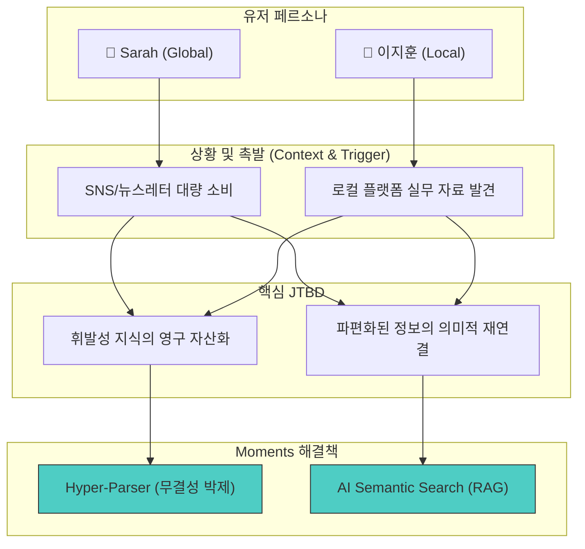

# PHASE 3 - 최종 완료 보고서

## 📋 PHASE 3 전체 개요

**작업일:** 2026-01-10
**상태:** ✅ 완료
**분석 대상:** 글로벌 및 하이퍼 로컬 페르소나 (4종)
**설계 방식:** JTBD (Jobs-to-be-Done) 및 AI 롤플레이 검증
**데이터 출처:** PHASE 3 각 Step별 상세 리포트

---

## 🎯 PHASE 3 목표

**프로젝트 실행 가이드에 정의된 PHASE 3 수행:**
1. **페르소나 설계:** 기술 수용도와 시장(Global/Local)에 따른 4가지 핵심 타겟 정의
2. **Context-Trigger-JTBD:** 유저가 제품을 찾는 '결정적 상황'과 '근본적 목적' 매핑
3. **AI 롤플레이 검증:** 가상 인터뷰를 통한 Pain Point의 심각도 및 빈도 검증
4. **우선순위 매트릭스:** 제품 개발의 핵심 우선순위(MVP 기능) 도출
5. **통합 다이어그램:** 유저 여정과 해결책의 인과관계 시각화

---

## 📍 STEP 1: 페르소나 설계 (Global-First)

글로벌 확장성과 한국 시장의 특수성을 동시에 고려한 4개 페르소나를 설계했습니다.

| **페르소나** | **핵심 특징** | **주요 행동 패턴** | **주요 니즈** |
| :--- | :--- | :--- | :--- |
| **Sarah Mitchell** | Global AI Savvy (SF) | X, Reddit, Arxiv 헤비 유저 | 지식 파편화 통합, 개인화 RAG |
| **이지훈 (PM)** | Hyper-Local Champion | 국문(네이버/브런치) + 영문 혼용 | 로컬 플랫폼 무결성 박제 |
| **Elena Rossi** | Multilingual Researcher | 다국어 소스 기반 트렌드 분석 | 초국가적 인사이트 연결 (감성 검색) |
| **Marcus Chen** | Enterprise Strategist | 기업 보안 및 팀 협업 중시 | Privacy-First Local LLM, B2B 보안 |

---

## 📍 STEP 2: Context-Trigger-JTBD 매핑

유저가 'Moments'를 사용하게 되는 12가지 시나리오를 발굴하여 JTBD를 정의했습니다.

### 핵심 시나리오 요약
- **Sarah:** "파편화된 SNS 정보를 하나의 완성된 지식 덩어리로 박제하여 나중에 논리적으로 재구성하고 싶다."
- **이지훈:** "글로벌 도구가 제대로 처리하지 못하는 로컬 플랫폼(네이버 등)의 특수 구조를 완벽하게 보완하고 싶다."
- **Elena:** "다국어 소스들 사이의 정서적 연관성을 발견하고 '성좌형 그래프'를 통해 초국가적 통찰을 얻고 싶다."
- **Marcus:** "기업 보안 가이드를 준수하면서도 최신 AI 분석 기능을 로컬 인프라 내에서 활용하고 싶다."

---

## 📍 STEP 3: AI 롤플레이 심층 검증

AI 페르소나 시뮬레이션을 통해 Pain Point의 진실성을 검증하고 감정 키워드를 추출했습니다.

- **반복 키워드:** "번거로움", "시간 낭비", "어디 있는지 모름", "찾다 포기함"
- **감정의 흐름:** 기대감(저장 시) → 불안감(필요 시) → **좌절감(검색 실패 시)**
- **핵심 발견:** 유저는 단순히 '저장'하는 것이 아니라, 저장한 데이터가 내 사고를 보조하는 '지식 비서'가 되기를 간절히 원함.

---

## 📍 STEP 4: Pain Point 우선순위 매트릭스

심각도와 발생 빈도를 결합하여 MVP에서 해결해야 할 핵심 과제를 도정했습니다.

| **Pain Point** | **점수 (심각×빈도)** | **우선순위** | **핵심 해결책** |
| :--- | :--- | :--- | :--- |
| **Collector's Fallacy (저장 후 방치)** | **25** (5x5) | 🔴 최우선 | 의미적 RAG 검색, 감성 엔진 |
| **로컬 플랫폼(네이버/브런치) 박제 실패** | **25** (5x5) | 🔴 최우선 | 하이퍼 로컬 파서 (KR 어댑터) |
| **기업 보안 및 Privacy 우려** | **25** (5x5) | 🔴 최우선 | Privacy-First Local LLM |
| **수동 태깅 및 정리 시간 소모** | **20** (4x5) | 🟡 높음 | AI 자동 태깅 및 분류 |

---

## 📍 STEP 5: 페르소나-JTBD 통합 다이어그램



---

## 📊 PHASE 3 완료 요약

### 작업 완료 상태

| Step | 상태 | 주요 산출물 |
| :--- | :--- | :--- |
| **Step 1** | ✅ 완료 | 4개 글로벌 페르소나 프로필 |
| **Step 2** | ✅ 완료 | 12개 Context-Trigger-JTBD 시나리오 |
| **Step 3** | ✅ 완료 | AI 롤플레이 인터뷰 분석 (감정 맵핑) |
| **Step 4** | ✅ 완료 | Pain Point 우선순위 매트릭스 |
| **Step 5** | ✅ 완료 | 페르소나-JTBD 통합 시각화 자료 |

---

## 📄 PHASE 3 전체 문서 구조

```
output/PHASE3-페르소나JTBD/
├── PHASE3-Step1-페르소나설계-2026-01-10.md    ✅ 완료
├── PHASE3-Step2-ContextTriggerJTBD-2026-01-10.md ✅ 완료
├── PHASE3-Step3-AI롤플레이-2026-01-10.md        ✅ 완료
├── PHASE3-Step4-PainPoint우선순위-2026-01-10.md ✅ 완료
├── PHASE3-Step5-통합다이어그램-2026-01-10.md     ✅ 완료
├── PHASE3-개요.md                               ✅ 완료
└── PHASE3-최종완료보고서-2026-01-10.md             ✅ 완료 (이 문서)
```

---

*문서 생성일: 2026-01-10*
*마지막 업데이트: 2026-01-10*
