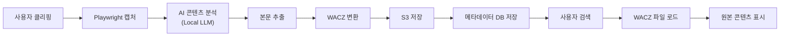
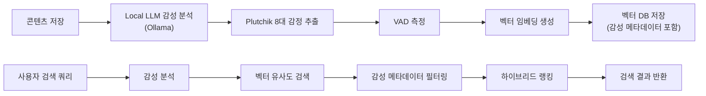
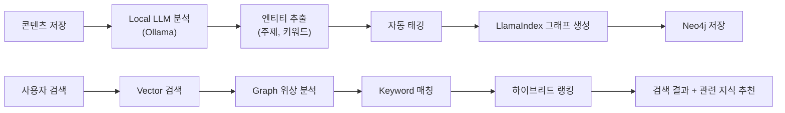
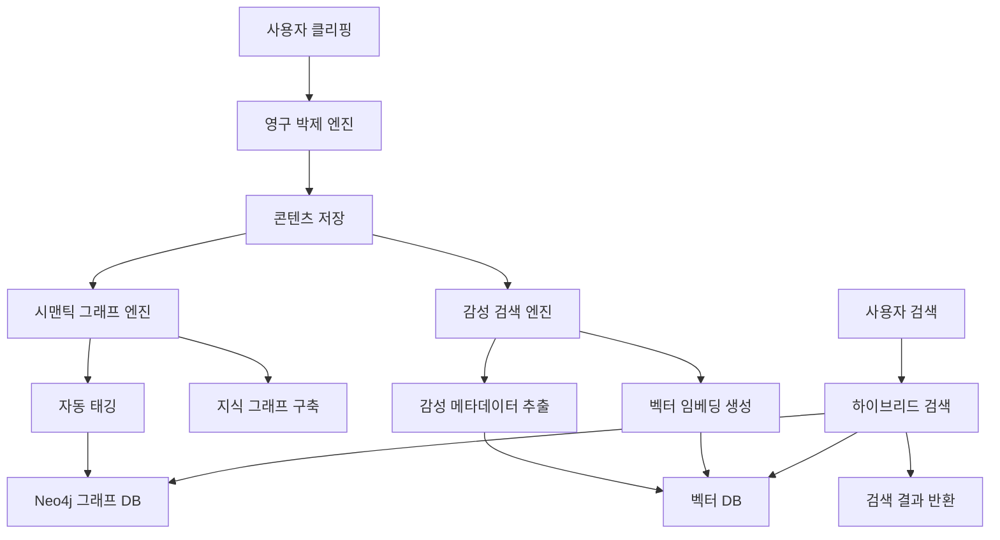

# PHASE 5 - Step 2: AI 적용 포인트 정의

## 📋 Step 2 개요

**작업일:** 2026-01-10
**상태:** ⏳ 진행 중
**목표:** AI 기술을 어디에 어떻게 적용할지 명확히 정의

**참고 자료:**
- 프로젝트 개요: 3대 핵심 엔진 (영구 박제, 감성 검색, 시맨틱 그래프)
- PHASE 2: AI 적용 기회 (AI 자동 태깅, AI 감성 검색 엔진)
- PHASE 3: 핵심 Pain Point (Collector's Fallacy, 수동 태깅)

---

## 🎯 AI 적용 포인트 개요

### 3대 핵심 엔진

| **엔진** | **AI 기술** | **목적** | **우선순위** |
| --- | --- | --- | --- |
| **1. 영구 박제 엔진** | 웹 스크래핑 AI | 원본 URL 보존 | Phase 1 |
| **2. 감성 검색 엔진** | Plutchik 8대 감정 + VAD | 감성적 검색 | Phase 2 |
| **3. 시맨틱 그래프 엔진** | LlamaIndex + Neo4j | 지식 연결 | Phase 1 |

---

## 🔧 AI 적용 포인트 1: 영구 박제 엔진 (Permanent Archive Engine)

### 적용 영역

**목적:** 원본 URL이 사라져도 사진관 안의 지식은 영원히 보존

### AI 기술 스택

| **기술 요소** | **기술 스택** | **역할** |
| --- | --- | --- |
| **웹 스크래핑** | Playwright + SingleFile CLI | 웹페이지 캡처 |
| **콘텐츠 추출** | AI 기반 콘텐츠 분석 | 본문/광고 구분 |
| **포맷 변환** | WACZ (Web Archive Collection Zipped) | 영구 보존 포맷 |
| **저장** | S3 (AWS) | 클라우드 저장 |

### 기능 설명

**1. 웹페이지 캡처 (2초 이내)**
- 브라우저 확장 프로그램으로 원클릭 캡처
- Playwright로 전체 페이지 렌더링
- SingleFile CLI로 HTML 단일 파일 변환

**2. AI 기반 콘텐츠 추출**
- Local LLM (Ollama)로 본문/광고/네비게이션 구분
- 핵심 콘텐츠만 추출하여 저장 용량 최적화
- 메타데이터 자동 추출 (제목, 작성자, 날짜)

**3. WACZ 포맷 변환 및 로컬 파싱 보완**
- Web Archive Collection Zipped 포맷으로 변환 (무결성 보장)
- **네이버 블로그(iframe), 브런치(JSON), 다음 카페 등 국내 환경 특화 파싱 로직 적용**
- 원본 URL, 타임스탬프, 메타데이터 포함

**4. 클라우드 저장**
- S3에 WACZ 파일 저장
- 비용: 캡처당 ~$0.01-0.05
- CDN 연동으로 빠른 접근

### 데이터 수집 → 학습 → 추론 프로세스

### 기술 실현 가능성 검토

| **기술 요소** | **실현 가능성** | **우선순위** | **비고** |
| --- | --- | --- | --- |
| **Playwright 캡처** | ✅ 높음 | 🔴 최우선 | 성숙한 기술 |
| **SingleFile CLI** | ✅ 높음 | 🔴 최우선 | 오픈소스 |
| **Local LLM 분석** | 🟡 중간 | 🟡 높음 | Ollama 활용 |
| **WACZ 변환** | ✅ 높음 | 🔴 최우선 | 표준 포맷 |
| **S3 저장** | ✅ 높음 | 🔴 최우선 | AWS 인프라 |

**MVP (Phase 1):**
- SingleFile CLI + S3 저장 (AI 분석 제외)
- 비용: 캡처당 ~$0.01

**확장 (Phase 2):**
- Playwright + AI 콘텐츠 분석 + WACZ
- 비용: 캡처당 ~$0.05

---

## 🔧 AI 적용 포인트 2: 감성 검색 엔진 (Emotional Search Engine)

### 적용 영역

**목적:** "비 오던 날의 우울했던 기억"과 닮은 지식을 찾아주는 감성 검색

### AI 기술 스택

| **기술 요소** | **기술 스택** | **역할** |
| --- | --- | --- |
| **감성 분석** | Plutchik 8대 감정 + VAD | 감성 메타데이터 추출 |
| **LLM 처리** | Local LLM (Ollama) | 프라이버시 우선 처리 |
| **벡터 검색** | 벡터 DB (Pinecone/Weaviate) | 유사도 검색 |
| **하이브리드 검색** | 벡터 + 감성 메타데이터 | 정확도 향상 |

### 기능 설명

**1. 감성 메타데이터 추출 (한국어 최적화)**
- Plutchik 8대 감정: 기쁨, 슬픔, 분노, 공포, 놀람, 혐오, 기대, 신뢰
- **한국어 고유의 정서(답답함, 막막함, 희열 등)를 반영한 로컬 감성 사전 연동**
- Local LLM (Ollama)로 콘텐츠 감성 분석

**2. 벡터 임베딩 생성**
- 텍스트를 벡터로 변환 (OpenAI/Cohere 임베딩)
- 감성 메타데이터와 함께 저장
- 벡터 DB에 인덱싱

**3. 하이브리드 검색**
- 사용자 쿼리의 감성 분석
- 벡터 유사도 검색 + 감성 메타데이터 필터링
- 최종 결과 랭킹

**4. 프라이버시 보장**
- Local LLM (Ollama) 우선 처리
- 클라우드 LLM은 선택적 사용
- 사용자 데이터 로컬 처리

### 데이터 수집 → 학습 → 추론 프로세스

### 기술 실현 가능성 검토

| **기술 요소** | **실현 가능성** | **우선순위** | **비고** |
| --- | --- | --- | --- |
| **Plutchik 감정 모델** | ✅ 높음 | 🟡 높음 | 연구 논문 기반 |
| **VAD 측정** | ✅ 높음 | 🟡 높음 | 표준 방법론 |
| **Local LLM (Ollama)** | ✅ 높음 | 🔴 최우선 | 오픈소스 |
| **벡터 DB** | ✅ 높음 | 🔴 최우선 | Pinecone/Weaviate |
| **하이브리드 검색** | 🟡 중간 | 🟡 높음 | 알고리즘 개발 필요 |

**MVP (Phase 1):**
- 기본 벡터 검색 (감성 분석 제외)
- KPI: 검색 성공률 50%

**확장 (Phase 2):**
- 감성 검색 엔진 완전 구현
- KPI: 감성 분석 정확도 F1 Score 0.75+, 응답 속도 500ms 이내

---

## 🔧 AI 적용 포인트 3: 시맨틱 그래프 엔진 (Semantic Graph Engine)

### 적용 영역

**목적:** 저장한 지식을 자동으로 연결하여 지식 네트워크 구축

### AI 기술 스택

| **기술 요소** | **기술 스택** | **역할** |
| --- | --- | --- |
| **그래프 DB** | Neo4j | 지식 그래프 저장 |
| **프레임워크** | LlamaIndex (PropertyGraphIndex) | 그래프 생성 |
| **최적화** | LazyGraphRAG 패턴 | 운영 비용 절감 |
| **검색** | Vector + Graph + Keyword | 하이브리드 검색 |

### 기능 설명

**1. 자동 태깅/카테고리링**
- Local LLM (Ollama)로 콘텐츠 분석
- 자동 태그 추출 (주제, 키워드, 카테고리)
- 정확도: 80%+ 목표

**2. 지식 그래프 구축**
- LlamaIndex로 엔티티/관계 추출
- Neo4j에 그래프 저장
- 자동 연결 생성

**3. LazyGraphRAG 최적화**
- 필요한 노드만 동적 로드
- 운영 비용 70-90% 절감
- 검색 속도 향상

**4. 하이브리드 검색**
- Vector 유사도 + Graph 위상 구조 + Keyword
- 정확도 향상
- 관련 지식 자동 추천

### 데이터 수집 → 학습 → 추론 프로세스

### 기술 실현 가능성 검토

| **기술 요소** | **실현 가능성** | **우선순위** | **비고** |
| --- | --- | --- | --- |
| **LlamaIndex** | ✅ 높음 | 🔴 최우선 | 오픈소스 프레임워크 |
| **Neo4j** | ✅ 높음 | 🔴 최우선 | 성숙한 그래프 DB |
| **LazyGraphRAG** | 🟡 중간 | 🟡 높음 | 최적화 패턴 구현 필요 |
| **자동 태깅** | ✅ 높음 | 🔴 최우선 | Local LLM 활용 |
| **하이브리드 검색** | 🟡 중간 | 🟡 높음 | 알고리즘 개발 필요 |

**MVP (Phase 1):**
- 자동 태깅/카테고리링 (그래프 제외)
- KPI: 태깅 정확도 80%+

**확장 (Phase 2):**
- 시맨틱 그래프 엔진 완전 구현
- KPI: 지식 연결 정확도 70%+, 검색 속도 500ms 이내

---

## 🤖 AI 기술 통합 아키텍처

### 전체 AI 파이프라인

### Local LLM 우선 전략

**프라이버시 보장:**
- Local LLM (Ollama)로 우선 처리
- 클라우드 LLM은 선택적 사용 (사용자 동의)
- 민감한 데이터는 로컬 처리

**비용 효율성:**
- Local LLM으로 API 비용 절감
- 클라우드 LLM은 고품질 요청만 사용
- 운영 비용 70-90% 절감

---

## 📊 AI 적용 포인트 우선순위

### Phase 1 (MVP) - 최우선 AI 기능

| **순위** | **AI 기능** | **엔진** | **목적** | **KPI** |
| --- | --- | --- | --- | --- |
| **1** | 자동 태깅/카테고리링 | 시맨틱 그래프 | 시간 절감 90% | 태깅 정확도 80%+ |
| **2** | RAG 검색 (의미적 검색) | 시맨틱 그래프 | Collector's Fallacy 해결 | 검색 성공률 50%+ |
| **3** | 영구 박제 (WACZ) | 영구 박제 | 데이터 영구 보존 | 링크 깨짐 방지율 100% |

**기술 스택:**
- Local LLM (Ollama) - 자동 태깅
- 벡터 DB (Pinecone/Weaviate) - RAG 검색
- SingleFile CLI + S3 - 영구 박제

---

### Phase 2 (성장) - 추가 AI 기능

| **순위** | **AI 기능** | **엔진** | **목적** | **KPI** |
| --- | --- | --- | --- | --- |
| **4** | 감성 검색 엔진 | 감성 검색 | 정서적 연결 형성 | F1 Score 0.75+, 500ms 이내 |
| **5** | 지식 그래프 구축 | 시맨틱 그래프 | 지식 자동 연결 | 연결 정확도 70%+ |
| **6** | LazyGraphRAG 최적화 | 시맨틱 그래프 | 운영 비용 절감 | 비용 70-90% 절감 |

**기술 스택:**
- Plutchik 8대 감정 + VAD - 감성 분석
- LlamaIndex + Neo4j - 지식 그래프
- LazyGraphRAG 패턴 - 최적화

---

### Phase 3 (확장) - 고급 AI 기능

| **순위** | **AI 기능** | **엔진** | **목적** | **KPI** |
| --- | --- | --- | --- | --- |
| **7** | AI 어시스턴트 (챗봇) | 통합 | 사용자 지원 | 응답 정확도 85%+ |
| **8** | 자동 요약/요점 추출 | 시맨틱 그래프 | 콘텐츠 이해도 향상 | 요약 정확도 80%+ |
| **9** | 개인화 추천 | 통합 | 맞춤형 경험 | 추천 정확도 70%+ |

---

## 🎯 기술 실현 가능성 종합 평가

### 전체 기술 스택 평가

| **기술 영역** | **실현 가능성** | **우선순위** | **리스크** |
| --- | --- | --- | --- |
| **영구 박제** | ✅ 높음 | 🔴 최우선 | 낮음 |
| **자동 태깅** | ✅ 높음 | 🔴 최우선 | 낮음 |
| **RAG 검색** | ✅ 높음 | 🔴 최우선 | 낮음 |
| **감성 검색** | 🟡 중간 | 🟡 높음 | 중간 |
| **지식 그래프** | 🟡 중간 | 🟡 높음 | 중간 |
| **LazyGraphRAG** | 🟡 중간 | 🟢 중간 | 높음 |

### 리스크 완화 전략

**1. 감성 검색 엔진 리스크:**
- MVP에서 기본 벡터 검색으로 시작
- Phase 2에서 감성 검색 점진적 도입
- 사용자 피드백 기반 개선

**2. 지식 그래프 리스크:**
- MVP에서 자동 태깅만 구현
- Phase 2에서 그래프 구축 시작
- LazyGraphRAG는 Phase 3에서 도입

**3. Local LLM 리스크:**
- Ollama 대체 방안 준비 (LM Studio 등)
- 클라우드 LLM 폴백 전략
- 하이브리드 처리 전략

---

## 📌 다음 단계 (서비스 구조 설계)

AI 적용 포인트 정의 완료 후, 다음 Step 3에서 서비스 구조를 설계합니다.

**Step 3 준비 사항:**
- 핵심 기능 정의
- 사용자 플로우 설계
- 비즈니스 모델 정의

---

*문서 생성일: 2026-01-10*
*마지막 업데이트: 2026-01-10*
