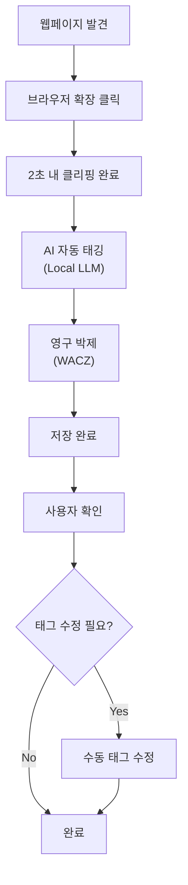
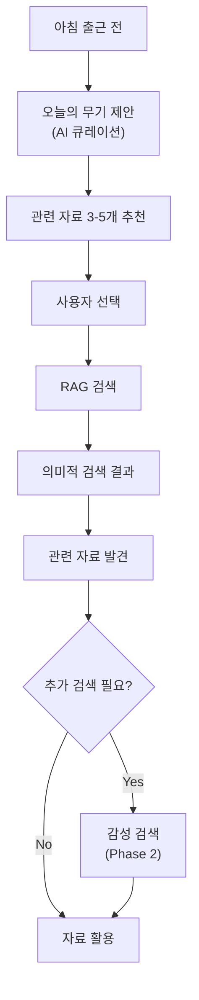
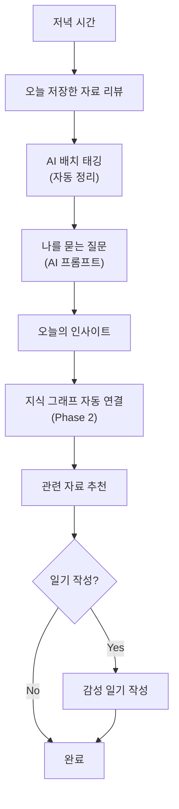
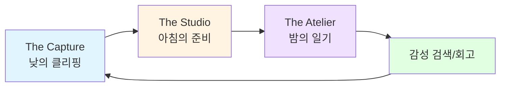

# PHASE 5 - Step 3: 서비스 구조 설계

## 📋 Step 3 개요

**작업일:** 2026-01-10
**상태:** ⏳ 진행 중
**목표:** 서비스 구조, 핵심 기능, 사용자 플로우, 비즈니스 모델 설계

**참고 자료:**
- PHASE 5 Step 1: 핵심 가치 제안
- PHASE 5 Step 2: AI 적용 포인트
- PHASE 3: 4개 페르소나, 3가지 핵심 기둥
- PHASE 4: 페르소나별 ARPU, 비즈니스 모델 기초

---

## 🎯 서비스 구조 개요

### 3가지 핵심 기둥 (The Three Pillars)

```
┌─────────────────────────────────────────────────────────────────┐
│                    Moments: Mind Studio                         │
├─────────────────┬─────────────────┬─────────────────────────────┤
│   The Capture   │   The Studio    │        The Atelier          │
│   (낮의 클리핑)  │  (아침의 준비)   │       (밤의 일기)            │
├─────────────────┼─────────────────┼─────────────────────────────┤
│ 2초 안에 완료    │ 오늘의 무기 제안  │ AI 배치 + 수동 조정          │
│ 무드 컬러 각인   │ 퀵 카드 큐레이션  │ 나를 묻는 질문               │
│ 영구 박제       │ 이동시간 최적화   │ 지식의 자동 연결             │
└─────────────────┴─────────────────┴─────────────────────────────┘
```

---

## 🔧 핵심 기능 정의

### Phase 1 (MVP) - 필수 기능

| **기능** | **설명** | **필수 여부** | **우선순위** |
| --- | --- | --- | --- |
| **웹페이지 클리핑** | 브라우저 확장으로 원클릭 클리핑 | ✅ 필수 | 🔴 최우선 |
| **AI 자동 태깅** | Local LLM으로 자동 태그/카테고리 추출 | ✅ 필수 | 🔴 최우선 |
| **RAG 검색** | 의미적 검색으로 관련 자료 발견 | ✅ 필수 | 🔴 최우선 |
| **영구 박제 (WACZ)** | 원본 URL 보존, 링크 깨짐 방지 | ✅ 필수 | 🔴 최우선 |
| **기본 노트 툴 통합** | Obsidian, Notion 기본 연동 | ✅ 필수 | 🟡 높음 |
| **모바일 앱** | iOS/Android 기본 앱 | 🟡 선택 | 🟡 높음 |

**MVP 목표:**
- 박민수 (개발자) 타겟
- 핵심 Pain Point 해결 (자동 태깅, RAG 검색)
- 2-3개월 개발

---

### Phase 2 (성장) - 추가 기능

| **기능** | **설명** | **필수 여부** | **우선순위** |
| --- | --- | --- | --- |
| **감성 검색 엔진** | Plutchik 8대 감정 기반 감성 검색 | 🟡 선택 | 🟡 높음 |
| **팀 공유 기능** | 팀원들과 자료 공유, 협업 | ✅ 필수 | 🟡 높음 |
| **Notion 통합 강화** | Notion API 통합, 자동 동기화 | ✅ 필수 | 🟡 높음 |
| **지식 그래프** | LlamaIndex + Neo4j 기반 지식 연결 | 🟡 선택 | 🟢 중간 |
| **모바일 최적화** | 모바일-데스크톱 완전 동기화 | ✅ 필수 | 🟡 높음 |

**Phase 2 목표:**
- 이수진 (마케터) 타겟
- 팀 공유 기능으로 B2B 확장
- 3-4개월 개발

---

### Phase 3 (확장) - B2B 기능

| **기능** | **설명** | **필수 여부** | **우선순위** |
| --- | --- | --- | --- |
| **B2B 플랜** | 팀 공유, 관리자 기능, SSO | ✅ 필수 | 🟡 높음 |
| **온프레미스 옵션** | 기업 보안 정책 준수 | 🟡 선택 | 🟢 중간 |
| **API 플랫폼** | 개발자 API, 웹훅, 통합 | 🟡 선택 | 🟢 중간 |
| **LazyGraphRAG** | 운영 비용 70-90% 절감 | 🟡 선택 | 🟢 중간 |
| **D3.js 시각화** | 지식 그래프 시각화 | 🟡 선택 | 🟢 중간 |

**Phase 3 목표:**
- 최영호 (기업 R&D) 타겟
- B2B 매출 확대
- 4-6개월 개발

---

## 👤 사용자 플로우 설계

### The Capture (낮의 클리핑) - 핵심 플로우



**핵심 가치:**
- 2초 안에 클리핑 완료
- AI 자동 태깅으로 수동 작업 최소화
- 영구 박제로 링크 깨짐 걱정 없음

---

### The Studio (아침의 준비) - 검색 플로우



**핵심 가치:**
- 오늘의 무기 제안으로 관련 자료 자동 추천
- RAG 검색으로 의미적으로 관련 자료 발견
- 이동시간 최적화 (모바일)

---

### The Atelier (밤의 일기) - 회고 플로우



**핵심 가치:**
- AI 배치로 자동 정리
- 나를 묻는 질문으로 성찰 유도
- 지식의 자동 연결로 네트워크 효과

---

### 전체 사용자 여정 (User Journey)



**핵심 루프:**
- 저장 → 정리 → 검색 → 회고 → 재저장
- 매일 반복되는 자연스러운 플로우

---

## 💼 비즈니스 모델 정의

### 수익 모델

**Freemium 모델:**
- 무료 플랜: 기본 기능 (제한적)
- 프리미엄 플랜: 모든 기능
- B2B 플랜: 팀 공유, 관리자 기능

---

### 가격 정책

#### 개인 사용자 (B2C)

| **플랜** | **가격** | **기능** | **타겟 페르소나** |
| --- | --- | --- | --- |
| **무료** | $0/월 | • 클리핑 50개/월<br/>• 기본 검색<br/>• 로컬 저장 | 김지은 (대학원생) |
| **프리미엄** | $8/월<br/>($96/년) | • 무제한 클리핑<br/>• AI 자동 태깅<br/>• RAG 검색<br/>• 영구 박제<br/>• 노트 툴 통합 | 박민수 (개발자), 이수진 (마케터) |
| **학생 할인** | $5/월<br/>($60/년) | 프리미엄 기능 동일 | 김지은 (대학원생) |

**가격 근거:**
- 경쟁사 분석: Notion $8/월, Readwise $9.99/월
- 페르소나별 ARPU 목표: 박민수 $96/년, 이수진 $96/년
- 학생 할인: 김지은 $60/년

---

#### 기업 사용자 (B2B)

| **플랜** | **가격** | **기능** | **타겟 페르소나** |
| --- | --- | --- | --- |
| **팀** | $15/user/월<br/>($180/user/년) | • 프리미엄 기능<br/>• 팀 공유<br/>• 관리자 기능<br/>• SSO | 최영호 (기업 R&D) |
| **엔터프라이즈** | 맞춤 가격 | • 팀 기능<br/>• 온프레미스 옵션<br/>• 전담 지원 | 최영호 (기업 R&D) |

**가격 근거:**
- B2B ARPU 목표: 최영호 $180/년
- 경쟁사 분석: Notion Team $10/user/월
- 프리미엄 정당화: 팀 공유, 관리자 기능

---

### 타겟 고객

#### Phase 1 (MVP) - 초기 타겟

| **페르소나** | **비중** | **플랜** | **ARPU** | **전략** |
| --- | --- | --- | --- | --- |
| **박민수 (개발자)** | 60% | 프리미엄 $8/월 | $96/년 | API 통합, 개발자 커뮤니티 |
| **김지은 (대학원생)** | 40% | 무료 → 학생 할인 | $60/년 | 무료 플랜, 바이럴 마케팅 |

**Phase 1 목표:**
- 사용자 수: 28.5K 명 (1년)
- 프리미엄 전환율: 20%
- ARPU: $18.72/년 (평균)
- SOM: $0.492M

---

#### Phase 2 (성장) - 확장 타겟

| **페르소나** | **비중** | **플랜** | **ARPU** | **전략** |
| --- | --- | --- | --- | --- |
| **박민수 (개발자)** | 50% | 프리미엄 $8/월 | $96/년 | API 통합 강화 |
| **이수진 (마케터)** | 30% | 프리미엄 $8/월 | $96/년 | 팀 공유 기능 |
| **김지은 (대학원생)** | 20% | 학생 할인 $5/월 | $60/년 | 바이럴 마케팅 |

**Phase 2 목표:**
- 사용자 수: 85.5K 명 (2년)
- 프리미엄 전환율: 22%
- ARPU: $21.12/년 (평균)
- SOM: $1.502M

---

#### Phase 3 (확장) - B2B 타겟

| **페르소나** | **비중** | **플랜** | **ARPU** | **전략** |
| --- | --- | --- | --- | --- |
| **박민수 (개발자)** | 40% | 프리미엄 $8/월 | $96/년 | API 플랫폼 |
| **최영호 (기업 R&D)** | 30% | 팀 $15/user/월 | $180/년 | B2B 플랜 |
| **이수진 (마케터)** | 20% | 프리미엄 $8/월 | $96/년 | 팀 공유 |
| **김지은 (대학원생)** | 10% | 학생 할인 $5/월 | $60/년 | 바이럴 |

**Phase 3 목표:**
- 사용자 수: 142.5K 명 (3년)
- 프리미엄 전환율: 25%
- ARPU: $24/년 (평균)
- SOM: $2.713M
- B2B 매출 비중: 30%

---

### 성장 전략

#### 1. 바이럴 마케팅

**전략:**
- PKM 커뮤니티 공략 (Reddit, 개발자 커뮤니티)
- 무료 플랜으로 초기 사용자 확보
- 추천 프로그램 (친구 초대 시 1개월 무료)

**목표:**
- 바이럴 계수 (K-factor): 1.2+
- 초기 사용자 확보: 10,000명 (6개월)

---

#### 2. 개발자 생태계 구축

**전략:**
- API 플랫폼 제공
- GitHub, Notion 통합 강화
- 개발자 친화적 기능 (CLI 도구, 웹훅)

**목표:**
- API 사용자: 1,000명 (1년)
- 통합 앱: 10개+ (1년)

---

#### 3. B2B 확장

**전략:**
- 팀 공유 기능으로 B2B 진입
- 기업 R&D 타겟
- 온프레미스 옵션 제공

**목표:**
- B2B 고객: 100팀 (2년)
- B2B 매출 비중: 30% (3년)

---

## 📊 비즈니스 모델 요약

### 수익 구조

| **수익원** | **Phase 1** | **Phase 2** | **Phase 3** |
| --- | --- | --- | --- |
| **B2C 프리미엄** | 80% | 70% | 60% |
| **B2C 학생 할인** | 15% | 10% | 5% |
| **B2B 팀** | 0% | 10% | 25% |
| **B2B 엔터프라이즈** | 0% | 5% | 10% |
| **API 플랫폼** | 5% | 5% | 5% |

### 성장 지표

| **지표** | **Phase 1** | **Phase 2** | **Phase 3** |
| --- | --- | --- | --- |
| **사용자 수** | 28.5K | 85.5K | 142.5K |
| **프리미엄 전환율** | 20% | 22% | 25% |
| **ARPU** | $18.72/년 | $21.12/년 | $24/년 |
| **SOM** | $0.492M | $1.502M | $2.713M |
| **B2B 비중** | 0% | 15% | 30% |

---

## 📌 다음 단계 (시각화 및 산출물 통합)

서비스 구조 설계 완료 후, 다음 Step 4에서 시각화 자료를 생성하고 모든 분석 결과를 통합합니다.

**Step 4 준비 사항:**
- AI 분석 엔진 다이어그램
- 서비스 구조 시각화
- 모든 PHASE 결과 통합

---

*문서 생성일: 2026-01-10*
*마지막 업데이트: 2026-01-10*
