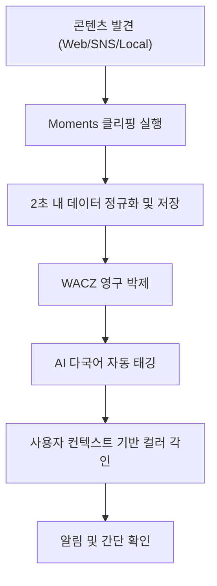
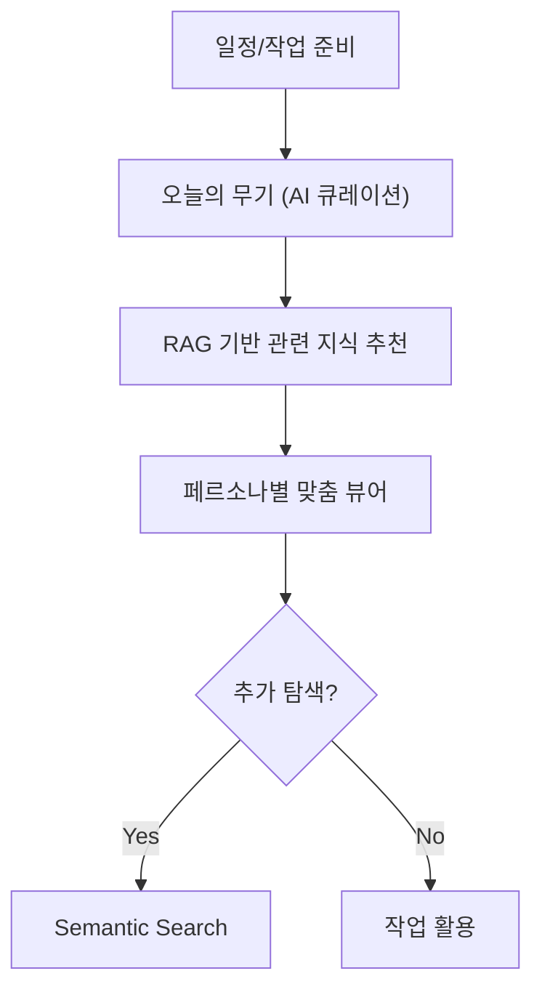
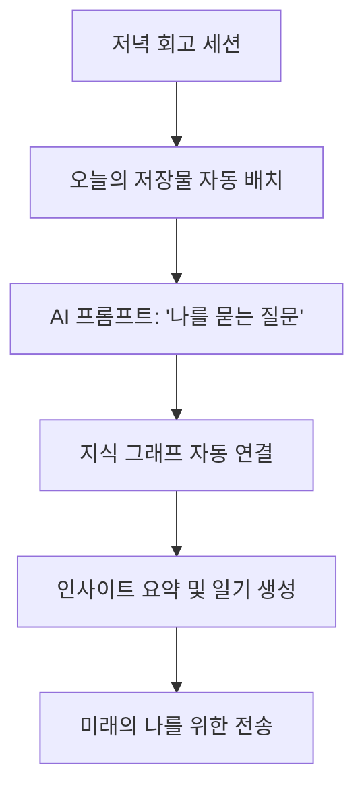

# PHASE 5 - Step 3: 서비스 구조 설계

## 📋 Step 3 개요

**작업일:** 2026-01-10
**상태:** ✅ 업데이트 완료 (글로벌 페르소나 반영)
**목표:** 글로벌 페르소나 기반 서비스 구조, 핵심 기능, 사용자 플로우, 비즈니스 모델 설계

**참고 자료:**
- PHASE 5 Step 1: 핵심 가치 제안
- PHASE 5 Step 2: AI 적용 포인트
- PHASE 3: 4개 글로벌 페르소나 (Sarah, 이지훈, Elena, Marcus)
- PHASE 4: 재추정된 시장 규모 (SAM $65.64M, SOM $1.12M)

---

## 🎯 서비스 구조 개요

### 3가지 핵심 기둥 (The Three Pillars)

```
┌─────────────────────────────────────────────────────────────────┐
│                    Moments: Mind Studio                         │
├─────────────────┬─────────────────┬─────────────────────────────┤
│   The Capture   │   The Studio    │        The Atelier          │
│   (낮의 클리핑)  │  (아침의 준비)   │       (밤의 일기)            │
├─────────────────┼─────────────────┼─────────────────────────────┤
│ 2초 안에 완료    │ 오늘의 무기 제안  │ AI 배치 + 수동 조정          │
│ 무드 컬러 각인   │ 퀵 카드 큐레이션  │ 나를 묻는 질문               │
│ 영구 박제 (WACZ) │ 의미적 연결 (RAG) │ 지식의 자동 연결 (Graph)      │
└─────────────────┴─────────────────┴─────────────────────────────┘
```

---

## 🔧 핵심 기능 정의

### Phase 1 (MVP) - 필수 기능

| **기능** | **설명** | **필수 여부** | **우선순위** |
| --- | --- | --- | --- |
| **웹페이지 클리핑** | 브라우저 확장으로 원클릭 클리핑 (Global Support) | ✅ 필수 | 🔴 최우선 |
| **하이퍼 로컬 파서** | 네이버, 브런치 등 로컬 플랫폼 완벽 파싱 | ✅ 필수 | 🔴 최우선 |
| **AI 자동 태깅** | Local LLM으로 다국어 태그/카테고리 추출 | ✅ 필수 | 🔴 최우선 |
| **RAG 검색** | 의미적 검색으로 관련 자료 발견 | ✅ 필수 | 🔴 최우선 |
| **영구 박제 (WACZ)** | 원본 URL 보존, 링크 깨짐 방지 | ✅ 필수 | 🔴 최우선 |
| **SNS 자산화** | X(Twitter), Substack 저장 최적화 | ✅ 필수 | 🟡 높음 |

**MVP 목표:**
- **Sarah Mitchell & 이지훈** 타겟
- 글로벌 접근성과 로컬 파싱 기술의 조화
- SOM $1.12M 달성을 위한 핵심 기능 구현

---

### Phase 2 (성장) - 추가 기능

| **기능** | **설명** | **필수 여부** | **우선순위** |
| --- | --- | --- | --- |
| **다국어 감성 엔진** | Plutchik 8대 감정 기반 다국어 감성 검색 | ✅ 필수 | 🟡 높음 |
| **지식 그래프 시각화** | LlamaIndex + Neo4j 기반 지식 연결 시각화 | 🟡 선택 | 🟡 높음 |
| **Notion/Obsidian 통합** | 양방향 AI 동기화 및 자동 정리 | ✅ 필수 | 🟡 높음 |
| **모바일 최적화** | 이동 시간 중 큐레이션 최적성 확보 | ✅ 필수 | 🟡 높음 |

**Phase 2 목표:**
- **Elena Rossi** 타겟 확장
- 다국어 리서치 및 지식 연결 가치 강화
- 매출 목표: $4.50M

---

### Phase 3 (확장) - B2B/Enterprise 기능

| **기능** | **설명** | **필수 여부** | **우선순위** |
| --- | --- | --- | --- |
| **온프레미스 LLM** | 기업 보안 정책 준수를 위한 서버형 LLM | ✅ 필수 | 🔴 최우선 |
| **팀 공유 및 협업** | 고유 지식 공유, 관리자 기능, SSO | ✅ 필수 | 🟡 높음 |
| **API 플랫폼** | 외부 서비스 연동을 위한 SDK/API 제공 | 🟡 선택 | 🟢 중간 |
| **LazyGraphRAG** | 대규모 데이터 운영 비용 70-90% 절감 | ✅ 필수 | 🟡 높음 |

**Phase 3 목표:**
- **Marcus Chen** 타겟
- B2B 보안 및 인프라 구축
- 매출 목표: $15.2M

---

## 👤 사용자 플로우 설계

### The Capture (낮의 클리핑) - 글로벌/로컬 통합 플로우



---

### The Studio (아침의 준비) - 의미적 검색 플로우



---

### The Atelier (밤의 일기) - 지식 연동 회고 플로우



---

## 💼 비즈니스 모델 정의

### 수익 모델 (Pricing Plans)

| **플랜** | **가격** | **핵심 타겟** | **주요 혜택** |
| --- | --- | --- | --- |
| **무료** | $0/월 | 신규 유입 (이지훈) | 50개 클리핑, 기본 검색 |
| **Standard** | $8/월 | **이지훈 (Local Expert)** | 로컬 파서 무제한, 무제한 저장 |
| **Premium** | $10/월 | **Sarah (Global Expert)** | 다국어 AI 태깅, SNS 자산화, RAG |
| **Scholar** | $5/월 | **Elena (Researcher)** | 다국어 감성 엔진, 지식 그래프 |
| **Business** | $15/user | **Marcus (Enterprise)** | 온프레미스 LLM, 팀 협업, 보안 |

---

### 시장 진입 및 성장 전략

#### 1. Phase 1 (MVP) - 초기 타겟

| **페르소나** | **목표 매출** | **플랜** | **실제 ARPU** | **확보 목표** |
| --- | --- | --- | --- | --- |
| **Sarah Mitchell** | $0.60M | Premium $10/월 | $30.0 | 20,000명 |
| **이지훈 (PM)** | $0.51M | Standard $8/월 | $19.2 | 26,500명 |

**Phase 1 목표:**
- 사용자 수: 46.5K 명 (1년)
- 프리미엄 전환율: 20-25%
- 총 매출 (SOM): $1.12M

---

#### 2. Phase 2: 다국어 리서치 확장 ($4.50M)
- **전략:** Elena를 위해 다국어 소스 간의 의미적 연결과 시각화 툴(Graph View) 강화.
- **채널:** 학술 커뮤니티, 전문 리서처 그룹.

#### 3. Phase 3: B2B 보안 및 인프라 구축 ($15.2M)
- **전략:** Marcus를 위해 개인정보 보드가 포함된 로컬 LLM 서버 모드와 팀 관리 기능 런칭.
- **채널:** 기업용 IT 솔루션 마켓, 다국적 기업 R&D 부서.

---

## 📊 수익성 분석 및 성장 지표

| **지표** | **Phase 1** | **Phase 2** | **Phase 3** |
| --- | --- | --- | --- |
| **사용자 수** | 46.5K | 120K | 250K |
| **프리미엄 전환율** | 20-25% | 25-28% | 30% |
| **ARPU (가중)** | $39.30/년 | $42.50/년 | $55.00/년 |
| **SOM** | $1.12M | $4.50M | $15.2M |
| **B2B 비중** | 0% | 10% | 35% |

---

## 📌 다음 단계 (최종 산출물 통합)

서비스 구조가 글로벌 페르소나와 정규화된 데이터에 맞춰 업데이트되었습니다. 다음 Step 4/5에서는 이 구조를 바탕으로 시각화 자료를 통합하고 최종 산출물을 완성합니다.

**Step 5 주요 반영 사항:**
- 글로벌 페르소나별 UX 시나리오 통합
- 시장 데이터 일관성 검증 (Final Check)
- 프로젝트 완료 선언 준비

---

*문서 생성일: 2026-01-10*
*마지막 업데이트: 2026-01-10 (글로벌 페르소나 v2 반영)*
