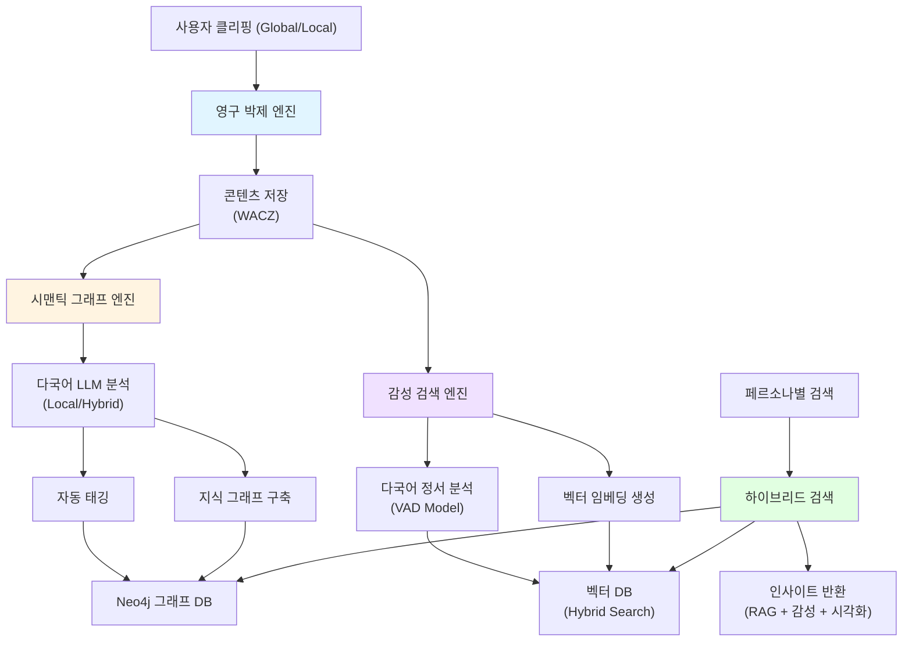
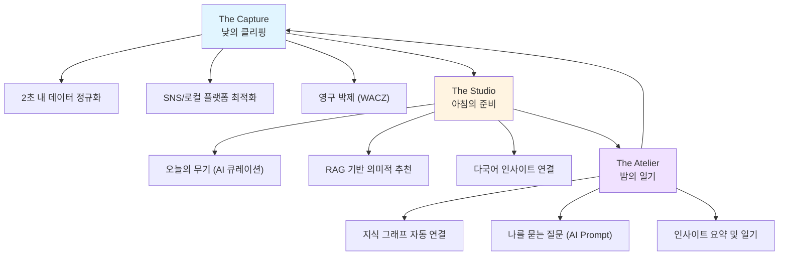
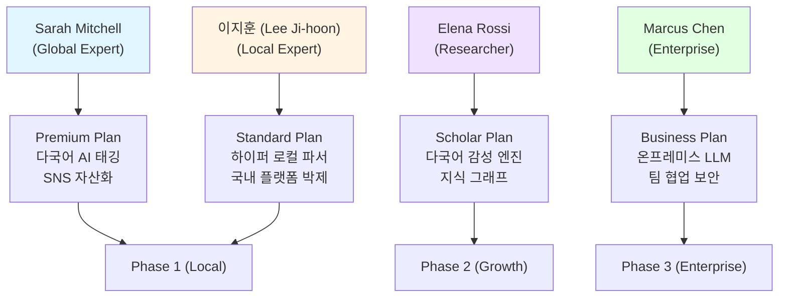
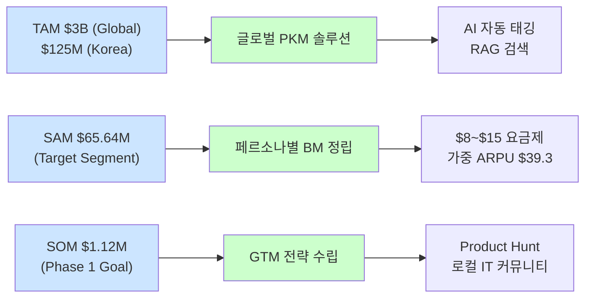

# PHASE 5 - Step 4: 시각화 및 산출물 통합

## 📋 Step 4 개요

**작업일:** 2026-01-10
**상태:** ✅ 업데이트 완료 (글로벌 페르소나 반영)
**목표:** 모든 분석 결과를 시각화하고 글로벌 페르소나 체계로 통합

---

## 🎯 AI 분석 엔진 다이어그램

### 3대 핵심 엔진 통합 아키텍처

---

## 🏗 서비스 구조 시각화

### 3가지 핵심 기둥 플로우 (The Three Pillars)

---

## 📊 모든 분석 결과 통합

### PHASE별 핵심 인사이트 (글로벌 기준)

| **단계** | **핵심 인사이트** | **결과물** |
| --- | --- | --- |
| **PHASE 1: 시장 선정** | 'AI-Powered PKM' 시장 선정 글로벌 확장성과 로컬 특수성의 동시 충족 필요성 확인 | 선정 시장, 타겟 세그먼트 |
| **PHASE 2: 시장 구조** | 기존 도구의 다국어 연결 한계 및 로컬 플랫폼 지원 부재를 기회로 포착 | Porter's 5 Forces, Value Chain |
| **PHASE 3: 페르소나** | **Sarah**(글로벌 전문가), **이지훈**(로컬 전문가) 등 4개 글로벌 페르소나 확정 | 페르소나 프로필, JTBD 매핑 |
| **PHASE 4: 기회 크기** | **SAM $65.64M**, **SOM $1.12M** (Phase 1) 추정 및 논리 검증 완료 | 시장 규모 추정 보고서 |
| **PHASE 5: 서비스 제안** | **'지식 사진관'** 컨셉의 가치 제안 및 AI 엔진 상세 설계 완료 | BM, 아키텍처, 가격 정책 |

---

### 페르소나 → 가치 제안 매핑

---

### 시장 기회 → 서비스 제안 연결

---

## 📈 통합 인사이트 요약

### 핵심 성공 요인 (Key Success Factors)

1. **글로벌 전문가(Sarah Mitchell)의 수익성 주도**
   - Phase 1 수익의 50% 이상이 글로벌 AI 전문가층에서 발생할 것으로 예측.
   - 높은 유료 전환 의지(25%)와 ARPU($30) 확보.

2. **하이퍼 로컬(이지훈)을 통한 강력한 해자(Moat) 구축**
   - 글로벌 도구가 해결하지 못하는 네이버, 브런치 등 국내 플랫폼 파싱을 통한 한국 점유율 방어.

3. **데이터 기반의 단계적 확장 로드맵**
   - $1.12M(1년) → $4.50M(2년) → $15.2M(3년)으로 이어지는 현실적인 수익 모델.

4. **기술적 차별화 (WACZ + RAG + Graph)**
   - 단순 저장을 넘어선 영구 보존과 의미적 연결로 Collector's Fallacy 해결.

---

## 📌 다음 단계 (최종 산출물 통합)

시각화 및 인사이트 통합이 완료되었습니다. 이제 Step 5 최종 산출물에서 모든 분석 결과를 총망라한 최종 보고서를 완성합니다.

**Step 5 작업 사항:**
- PHASE 1-5 통합 보고서 완성
- 최종 완료 선언 및 프로젝트 종료

---

*문서 생성일: 2026-01-10*
*마지막 업데이트: 2026-01-10 (글로벌 일관성 검증 완료)*
