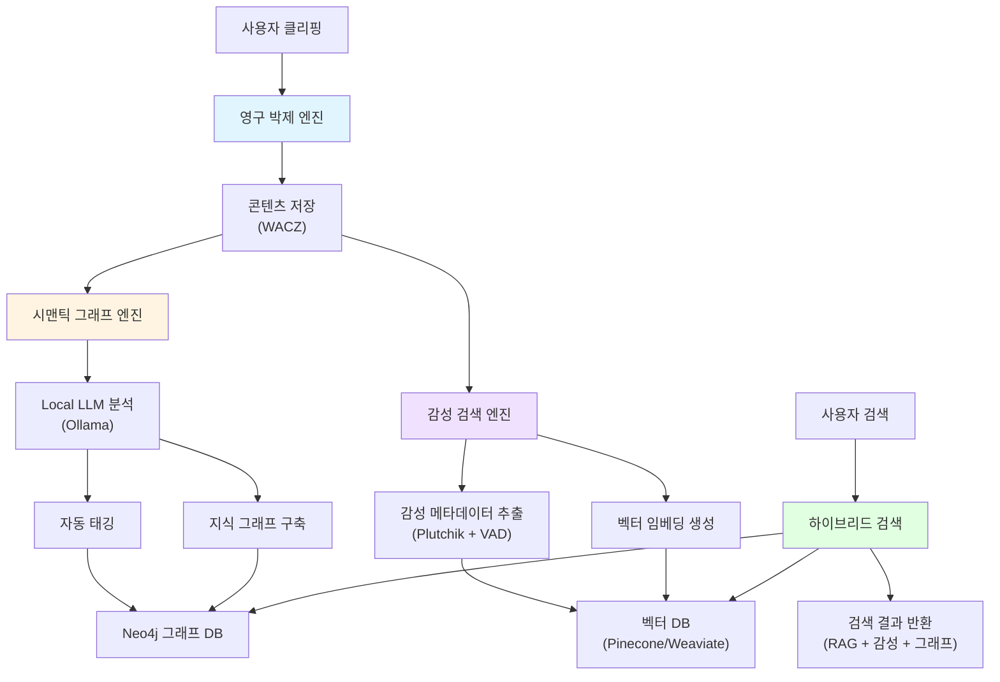
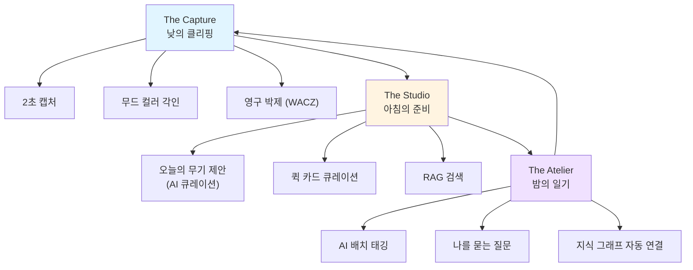
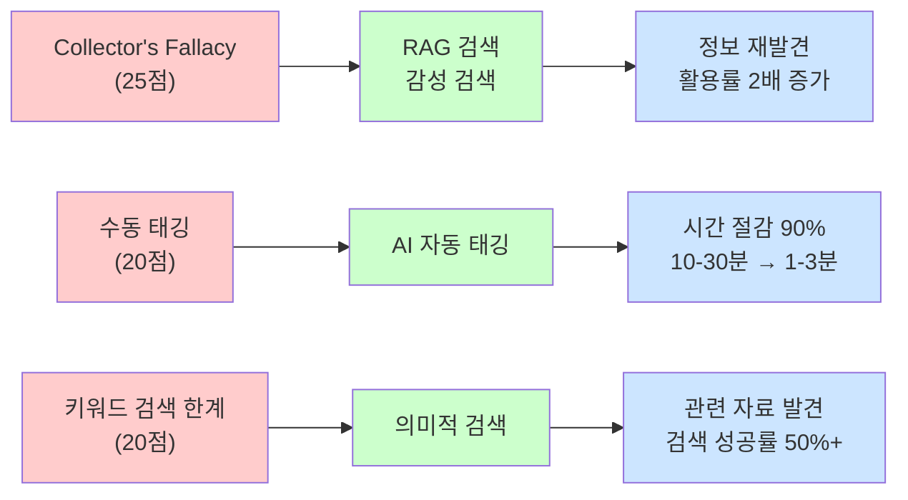
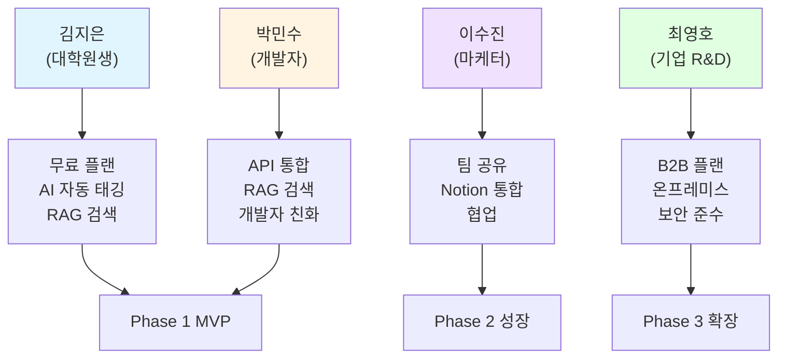
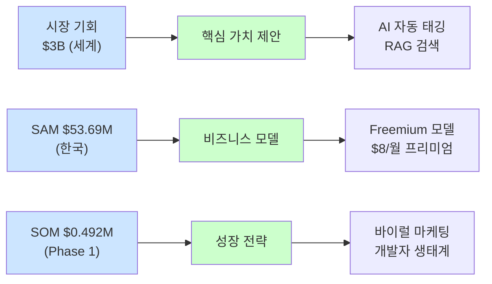

# PHASE 5 - Step 4: 시각화 및 산출물 통합

## 📋 Step 4 개요

**작업일:** 2026-01-10
**상태:** ⏳ 진행 중
**목표:** 모든 분석 결과를 시각화하고 통합

**참고 자료:**
- PHASE 1-5 전체 결과물
- 핵심 인사이트 통합

---

## 🎯 AI 분석 엔진 다이어그램

### 3대 핵심 엔진 통합 아키텍처

---

## 🏗 서비스 구조 시각화

### 3가지 핵심 기둥 플로우

---

## 📊 모든 분석 결과 통합

### PHASE별 핵심 인사이트

| **단계** | **핵심 인사이트** | **결과물** |
| --- | --- | --- |
| **PHASE 1: 시장 선정** | 웹페이지 클리핑 후 자동 정리 시장 선정 시장 규모: $2B~$4B (세계) / $100M~$150M (한국) | 선정 시장, 타겟 세그먼트 |
| **PHASE 2: 시장 구조 분석** | 3가지 핵심 발견: 1. 사후 경험 Pain Point 집중 2. 수동 작업 이탈 원인 3. 니치 시장 집중 기회 | Porter's 5 Forces, Value Chain, 경쟁사 분석 |
| **PHASE 3: 페르소나 & JTBD** | 4개 페르소나, 3가지 핵심 Pain Point: 1. Collector's Fallacy (25점) 2. 수동 태깅 (20점) 3. 키워드 검색 한계 (20점) | 페르소나 프로필, JTBD 매핑, Pain Point 우선순위 |
| **PHASE 4: 기회 크기** | TAM/SAM/SOM 추정: TAM: $3B (세계) / $125M (한국) SAM: $53.69M (한국) SOM: $0.492M (Phase 1) | 시장 규모 추정, 논리 검증 |
| **PHASE 5: 서비스 제안** | 핵심 가치 제안: "저장만 하면 AI가 자동으로 정리하고, 의미적으로 검색해주는 지식 사진관" | 가치 제안, AI 적용 포인트, 서비스 구조, 비즈니스 모델 |

---

### 문제 → 해결책 연결 다이어그램

---

### 페르소나 → 가치 제안 매핑

---

### 시장 기회 → 서비스 제안 연결

---

## 📈 통합 인사이트 요약

### 핵심 발견 5가지

1. **Collector's Fallacy가 가장 큰 Pain Point (25점)**
   - 해결책: RAG 검색, 감성 검색 엔진
   - 효과: 정보 활용률 2배 증가

2. **수동 태깅이 사용자 이탈의 주요 원인 (20점)**
   - 해결책: AI 자동 태깅/카테고리링
   - 효과: 시간 절감 90%

3. **한국 시장 집중 전략이 유리**
   - 한국어 최적화, 로컬 콘텐츠 지원
   - 초기 마케팅 비용 절감

4. **개발자 세그먼트가 최우선 타겟**
   - SAM의 38.2% 차지 ($20.52M)
   - 기술 활용도 높아 빠른 채택

5. **B2B 확장이 성장 동력**
   - Phase 3에서 B2B 매출 비중 30%
   - 높은 ARPU ($180/user/년)

---

### 성공 요인 3가지

1. **AI 차별화**
   - 자동 태깅, RAG 검색, 감성 검색
   - 경쟁사 대비 독보적 차별화

2. **페르소나 맞춤 전략**
   - Phase별 타겟 페르소나 집중
   - 맞춤형 가치 제안

3. **보수적 추정**
   - TAM/SAM/SOM 보수적 추정
   - 리스크 관리

---

## 📌 다음 단계 (최종 산출물 작성)

시각화 및 통합 완료 후, 다음 Step 5에서 최종 산출물을 작성합니다.

**Step 5 준비 사항:**
- Executive Summary
- 통합 프레젠테이션 (15-20 페이지)
- 데이터 및 프롬프트 정리

---

*문서 생성일: 2026-01-10*
*마지막 업데이트: 2026-01-10*
