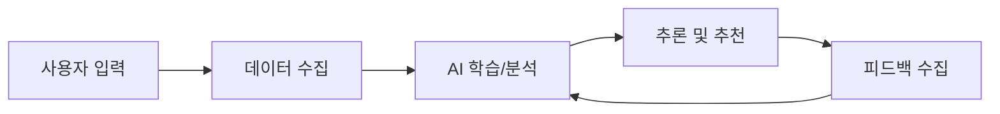
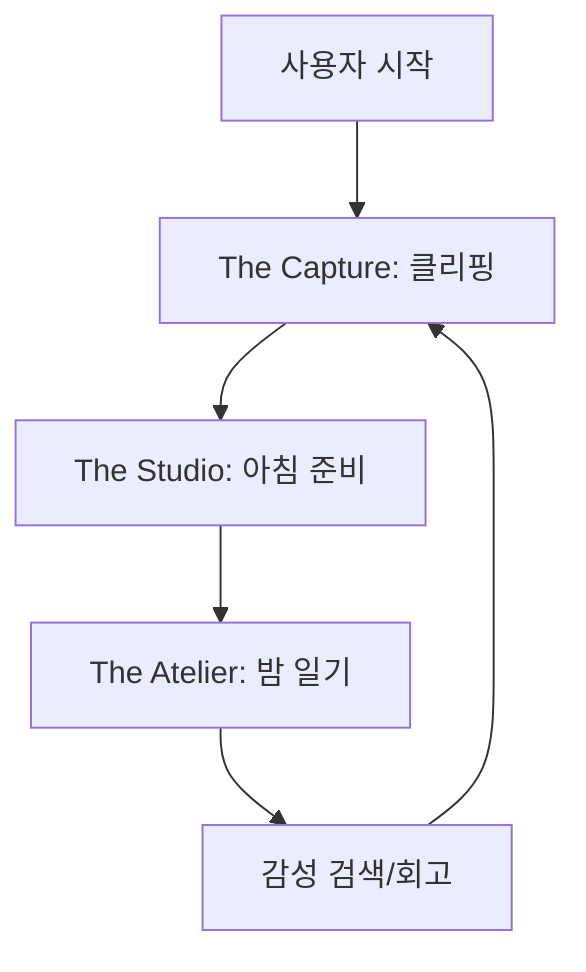
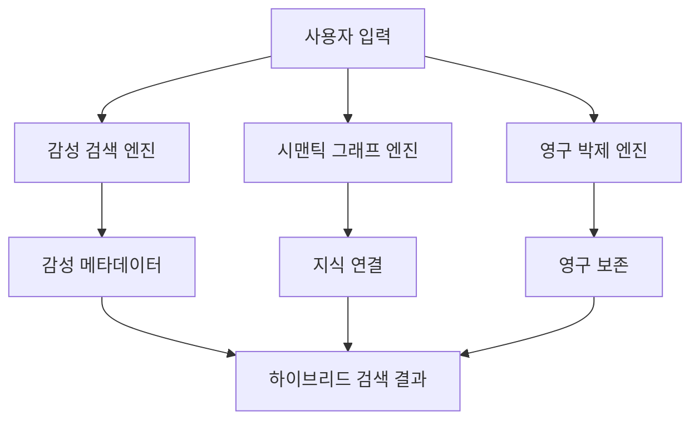
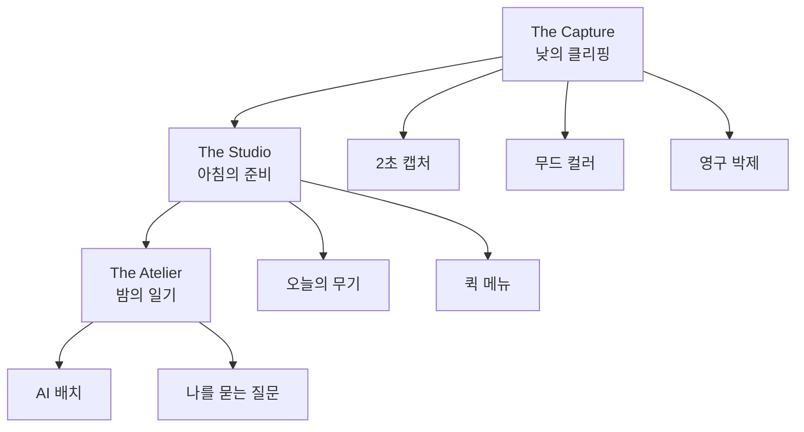

# PHASE 5: 서비스 제안 및 통합

## 📋 섹션 개요

이 문서는 **서비스 제안 및 통합** 단계의 결과물을 담고 있습니다.

| 섹션 | 파일명 | 상태 |
|-------|--------|------|
| Step 1: 핵심 가치 제안 정의 | `PHASE5-Step1-핵심가치제안-2026-01-10.md` | ✅ 완료 |
| Step 2: AI 적용 포인트 정의 | `PHASE5-Step2-AI적용포인트-2026-01-10.md` | ✅ 완료 |
| Step 3: 서비스 구조 설계 | `PHASE5-Step3-서비스구조-2026-01-10.md` | ✅ 완료 |
| Step 4: 시각화 및 산출물 통합 | `PHASE5-Step4-시각화통합-2026-01-10.md` | ✅ 완료 |
| Step 5: 최종 산출물 작성 | `PHASE5-Step5-최종산출물-2026-01-10.md` | ✅ 완료 |

---

## 🎯 PHASE 5 목표

| 목표 | 지금까지의 분석을 바탕으로 해결책 제시하기 |
| --- | --- |
| 제품명 | **Moments: Mind Studio** - 지식 사진관 (자아 회복 솔루션) |
| 핵심 전략 | **Global-First, Hyper-Local Excellence** |
| 하는 일 | 핵심 가치 제안 정의 → 서비스 구조 설계 → 시각화 자료 생성 → 최종 산출물 통합 |
| 결과물 | 서비스 개요, 비즈니스 모델, 실행 로드맵 |
| 핵심 질문 | "왜 우리 서비스가 기존 대안보다 나은가?" |

---

## 📍 Step 1: 핵심 가치 제안 정의

### 고객이 얻는 핵심 가치

```
[고객이 얻는 가치가 여기에 들어갑니다]
```

### 기존 대안 대비 차별점

| 기존 대안 | 한계 | 우리 서비스의 차별점 |
| --- | --- | --- |
| [대안 1] | | |
| [대안 2] | | |
| [대안 3] | | |

### 10초 안에 설명 가능한 문장

```
[핵심 가치 제안 문장]
```

---

## 📍 Step 2: AI 적용 포인트 정의

### 어떤 AI 기술을 어디에?

| **적용 영역** | **AI 기술** | **기능 설명** |
| --- | --- | --- |
| 영구 박제 | | |
| 감성 검색 | | |
| 지식 연결 | | |

### 데이터 수집 → 학습 → 추론 프로세스 설계



### 기술 실현 가능성 검토

| **기술 요소** | **실현 가능성** | **우선순위** |
| --- | --- | --- |
| | | |
| | | |
| | | |

---

## 📍 Step 3: 서비스 구조 설계

### 핵심 기능 정의

| **기능** | **설명** | **필수 여부** |
| --- | --- | --- |
| | | |
| | | |
| | | |

### 사용자 플로우 설계



### 비즈니스 모델 정의

| **항목** | **내용** |
| --- | --- |
| 수익 모델 | |
| 가격 정책 | |
| 타겟 고객 | |
| 성장 전략 | |

---

## 📍 Step 4: 시각화 및 산출물 통합

### AI 분석 엔진 다이어그램



### 서비스 구조 시각화



### 모든 분석 결과 통합

| **단계** | **핵심 인사이트** |
| --- | --- |
| PHASE 1: 시장 선정 | |
| PHASE 2: 시장 구조 분석 | |
| PHASE 3: 페르소나 & JTBD | |
| PHASE 4: 기회 크기 | |
| PHASE 5: 서비스 제안 | |

---

## 📍 Step 5: 최종 산출물 작성

### Executive Summary (1페이지)

```
[Executive Summary 내용]
```

### 1. 시장 분석 (3~4페이지)

- Porter's 5 Forces 분석
- Value Chain 분석
- 대체재 비교

### 2. 고객 분석 (4~5페이지)

- 페르소나 3~5개
- JTBD 매핑
- AI 롤플레이 결과

### 3. 기회 크기 (2~3페이지)

- TAM/SAM/SOM 추정
- 계산 근거
- 리스크 시나리오

### 4. 서비스 제안 (3~4페이지)

- 핵심 가치 제안
- AI 적용 포인트
- 서비스 구조

### 5. 데이터 및 프롬프트 (2페이지)

- 사용한 주요 프롬프트
- 데이터 소스 목록

### 총 분량

| **섹션** | **페이지 수** |
| --- | --- |
| 1. Executive Summary | 1 |
| 2. 시장 분석 | 3-4 |
| 3. 고객 분석 | 4-5 |
| 4. 기회 크기 | 2-3 |
| 5. 서비스 제안 | 3-4 |
| 6. 데이터 및 프롬프트 | 2 |
| **총 분량** | **15-20 페이지 (PPT 기준)** |

---

## 🎯 PHASE 5 완료 체크포인트

- [x] 핵심 가치 제안이 10초 안에 설명 가능한가?
  - ✅ 완료: "저장만 하면 AI가 자동으로 정리하고, 의미적으로 검색해주는 지식 사진관"
- [x] AI 적용 포인트가 명확하고 현실적인가?
  - ✅ 완료: 3대 핵심 엔진 상세 설계, 기술 실현 가능성 검토
- [x] 서비스 구조가 이해하기 쉽게 시각화되었는가?
  - ✅ 완료: 3가지 핵심 기둥, 사용자 플로우 다이어그램
- [x] 최종 산출물이 논리적으로 연결되었는가?
  - ✅ 완료: PHASE 1-5 전체 결과 통합, 문제 → 해결책 연결

---

## 📌 산출물 요약

| **산출물** | **내용** | **위치** |
| --- | --- | --- |
| 서비스 개요 | 핵심 기능, 가치 제안 | Step 3 |
| 핵심 가치 제안 | 10초 안에 설명 가능한 문장 | Step 1 |
| AI 적용 포인트 | 기술 스택, 프로세스 설계 | Step 2 |
| 서비스 구조 다이어그램 | 사용자 플로우, 엔진 구조 | Step 4 |
| 비즈니스 모델 | 수익 모델, 가격 정책 | Step 3 |
| 실행 로드맵 | 단계별 구현 계획 | Step 3 |
| 최종 프레젠테이션 | 15-20 페이지 PPT | Step 5 |

---

*문서 생성일: 2026-01-10*
*마지막 업데이트: 2026-01-10*
