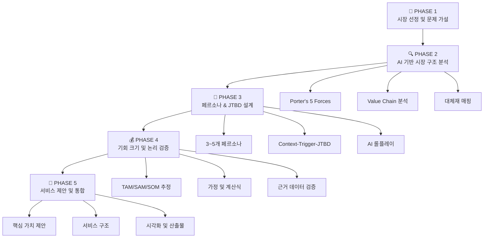
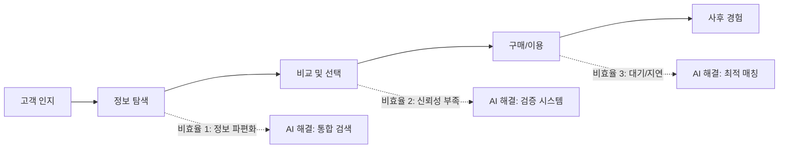
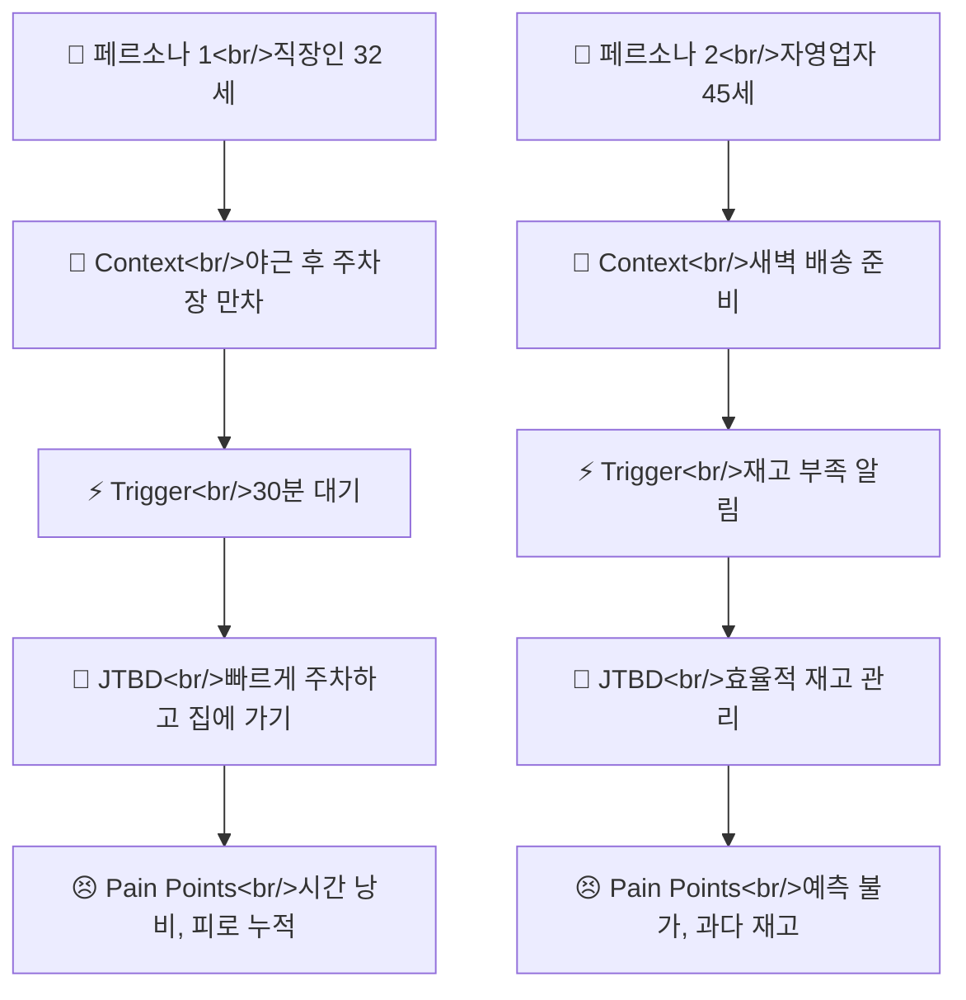
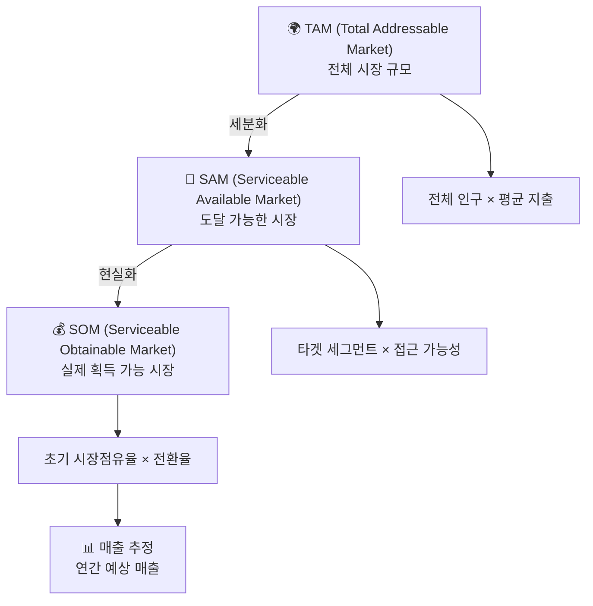
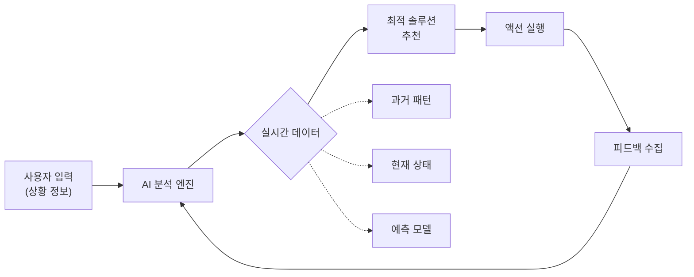

# 프로젝트1

# 📋 프로젝트 전체 구조 및 실행 프로세스

본 프로젝트는 **5단계 구조**로 진행되며, 각 단계마다 AI를 전략적으로 활용하여 데이터 기반 검증을 수행합니다.



---

## 🎯 프로젝트 실행 프로세스 요약

이 프로젝트는 **데이터 기반으로 시장 기회를 발굴하고 검증하는 5단계 프로세스**입니다. AI를 활용하여 각 단계를 체계적으로 진행합니다.

### 📍 1단계: 시장 선정 (어떤 문제를 풀 것인가?)

**목표:** 사람들이 당연하게 받아들이지만 실제로는 비효율적인 시장을 찾기

- **하는 일:** 일상/산업에서 반복되는 불편함 리스트업 → AI로 트렌드 분석 → 데이터 수집 → 최종 시장 1개 선정
- **결과물:** 선정된 시장, 구체적인 문제 가설 3~5개, 관련 통계 자료
- **핵심 질문:** "왜 이 문제가 지금까지 해결되지 않았는가?"

### 📍 2단계: 시장 구조 분석 (시장이 어떻게 돌아가는가?)

**목표:** 선정한 시장의 경쟁 구조와 가치 사슬을 파악하기

- **하는 일:** Porter's 5 Forces로 경쟁 환경 분석 → Value Chain으로 각 단계별 비효율 찾기 → 대체재 파악
- **결과물:** 시장 구조도, 비효율 발생 지점, AI 개입 가능 영역
- **핵심 질문:** "어디에 끼어들 수 있는가?"

### 📍 3단계: 고객 이해 (누가 언제 왜 필요한가?)

**목표:** 실제 고객이 문제를 겪는 상황과 동기를 구체화하기

- **하는 일:** 3~5개 페르소나 만들기 → 각 페르소나의 상황(Context), 계기(Trigger), 목적(JTBD) 정의 → AI 롤플레이로 검증
- **결과물:** 페르소나별 상세 프로필, 고객 여정 맵, Pain Point
- **핵심 질문:** "이 사람은 정확히 어떤 순간에 이 서비스를 찾는가?"

### 📍 4단계: 기회 크기 측정 (시장이 얼마나 큰가?)

**목표:** 비즈니스 기회를 숫자로 증명하기

- **하는 일:** TAM(전체 시장) → SAM(실제 공략 가능 시장) → SOM(초기 목표 시장) 계산 → 가정과 근거 문서화 → AI로 논리 검증
- **결과물:** 시장 규모 추정치, 계산 근거, 데이터 출처
- **핵심 질문:** "이 숫자를 어떻게 증명할 수 있는가?"

### 📍 5단계: 서비스 제안 (어떻게 해결할 것인가?)

**목표:** 지금까지의 분석을 바탕으로 해결책 제시하기

- **하는 일:** 핵심 가치 제안 정의 → 서비스 구조 설계 → 시각화 자료 생성 → 최종 산출물 통합
- **결과물:** 서비스 개요, 비즈니스 모델, 실행 로드맵
- **핵심 질문:** "왜 우리 서비스가 기존 대안보다 나은가?"

---

### 💡 전체 프로세스의 핵심 원칙

- **데이터 우선:** 모든 주장은 숫자와 출처로 뒷받침
- **AI 활용:** 반복 작업은 AI에게, 판단은 사람이
- **지속적 검증:** 각 단계마다 "이게 맞나?" 질문하기
- **구체성:** 추상적 표현 대신 구체적 수치와 예시 사용

<aside>
**🎯 이 프로세스를 마치면:**

"[시장]에서 [페르소나]가 [상황]일 때 [문제]를 해결하여 [가치]를 제공하는 서비스를 제안할 수 있으며, 이는 [숫자]의 시장 기회가 있다"는 문장을 데이터로 증명할 수 있습니다.

</aside>

# 🔄 단계별 상세 프로세스

## PHASE 1: 시장 선정 및 문제 가설 설정

| **목표** | 비효율이 존재하지만 당연하게 받아들여지는 시장 발굴 |
| --- | --- |
| **AI 활용** | ·트렌드 분석 AI (검색 및 리포트 요약)
·통계 데이터 수집 AI
·가설 생성 및 정제 |
| **산출물** | ·선정 시장 1개
·초기 문제 가설 3~5개·관련 통계/데이터 목록 |
| **평가 포인트** | "새로운 시장"이 아닌 "숨겨진 비효율"의 발견 여부 |

### 🔍 세부 실행 가이드

### Step 1: 시장 후보 리스트업

- **브레인스토밍:** 일상/산업/공공 영역에서 반복적으로 발생하는 불편함 10개 이상 나열
- **AI 트렌드 분석:** "최근 3년간 [영역]에서 가장 많이 언급된 불편 사항" 검색
- **초기 필터링:** 다음 기준으로 3개로 축소
    - 문제 발생 빈도가 높은가?
    - 현재 해결책이 불완전한가?
    - 데이터로 측정 가능한가?

### Step 2: 1차 데이터 수집

| **수집 항목** | **데이터 소스** | **AI 활용법** |
| --- | --- | --- |
| 시장 규모 | 통계청, 산업 리포트 | 다중 소스 교차 검증 프롬프트 |
| 고객 행동 | 설문 데이터, 리뷰 분석 | 감정 분석 및 키워드 추출 |
| 경쟁사 현황 | 기업 공시, 뉴스 | 구조화된 경쟁사 프로필 생성 |
| 기술 트렌드 | 특허, 논문, 기술 블로그 | 기술 적용 가능성 평가 |

### Step 3: 문제 가설 구체화

```markdown
당신은 시장 분석 전문가입니다.
다음 시장에 대해 분석하세요: [선정 시장명]

다음 형식으로 출력하세요:
1. **현재 상태 (As-Is)**
   - 고객들이 겪는 구체적 상황
   - 평균 소요 시간/비용
   - 감정적 반응

2. **근본 원인 (Root Cause)**
   - 왜 이 문제가 지속되는가?
   - 구조적 장벽은 무엇인가?

3. **기존 해결 시도**
   - 현재 대안들의 한계
   - 왜 완벽한 해결책이 없는가?

4. **검증 가능한 지표**
   - 문제의 심각성을 측정할 수 있는 수치
   - 데이터 수집 방법

각 항목마다 구체적 예시와 출처를 포함하세요.
```

### Step 4: 최종 시장 선정

- **평가 매트릭스 작성:** 3개 후보를 다음 기준으로 점수화 (각 10점 만점)
    
    
    | **기준** | **가중치** | **평가 질문** |
    | --- | --- | --- |
    | 문제 심각도 | 30% | 고객의 pain이 얼마나 큰가? |
    | 시장 규모 | 25% | 잠재 고객 수가 충분한가? |
    | 해결 가능성 | 25% | 현실적으로 해결 가능한가? |
    | 데이터 접근성 | 20% | 검증 가능한 데이터가 있는가? |
- **AI 의사결정 지원:** 각 시장의 장단점을 객관적으로 비교하는 프롬프트 실행
- **최종 선택:** 가장 높은 점수의 시장 1개 확정 + 선정 이유 문서화

### 🎯 핵심 체크포인트

<aside>
**이 단계를 완료했을 때 다음 질문에 답할 수 있어야 합니다:**

- 선정한 시장의 문제를 한 문장으로 설명할 수 있는가?
- 이 문제가 실제로 존재한다는 것을 어떤 데이터로 증명할 수 있는가?
- 왜 지금까지 완벽히 해결되지 않았는가?
- 이 문제를 해결하면 누가 가장 먼저 혜택을 받는가?
</aside>

### 💡 실전 프롬프트 전략

### 프롬프트 구조의 4요소

| **요소** | **설명** | **예시** |
| --- | --- | --- |
| 역할 (Role) | AI에게 어떤 전문가 역할 부여 | "당신은 10년 경력의 시장 조사 전문가입니다" |
| 목적 (Objective) | 달성하고자 하는 구체적 목표 | "다음 3개 시장 중 가장 기회가 큰 시장을 선정하세요" |
| 제약 (Constraint) | 출력 형식, 길이, 스타일 제한 | "각 시장당 200단어 이내, 표 형식으로 출력" |
| 예시 (Example) | 원하는 출력의 샘플 제시 | "다음과 같은 형식으로: 1. 시장명 2. 핵심 문제 3. 데이터 근거" |

### 고급 프롬프팅 기법

- **Chain-of-Thought (사고 과정 유도):** "단계별로 생각하며 답변하세요"
- **Multi-Turn (대화형 심화):** 첫 답변 받은 후 "3번 항목을 더 구체적으로 설명해주세요" 추가 질문
- **Role-Play (역할극):** "당신은 이 문제를 겪는 당사자입니다. 가장 답답한 순간을 묘사하세요"
- **Devil's Advocate (반론 생성):** "이 분석의 약점을 3가지 지적하세요"

### 📊 데이터 검증 체크리스트

- [ ]  AI가 제시한 통계에 출처가 명시되어 있는가?
- [ ]  같은 질문을 다르게 물어봤을 때 일관된 답변이 나오는가?
- [ ]  최소 2개 이상의 독립적 소스에서 교차 검증했는가?
- [ ]  수치의 논리적 계산 과정이 추적 가능한가?
- [ ]  AI가 "추정", "약", "대략" 같은 불확실한 표현을 사용했다면 그 근거를 확인했는가?

### 🚨 자주 발생하는 오류와 해결법

| **문제 상황** | **원인** | **해결 방법** |
| --- | --- | --- |
| AI가 너무 일반적인 답변 제공 | 프롬프트가 모호함 | 구체적 수치, 예시, 출력 형식 명시 |
| 데이터 출처가 불명확 | 검증 요청 누락 | "각 주장에 대해 출처를 명시하세요" 추가 |
| 분석이 피상적 | 깊이 요구 부족 | "왜?"를 3번 이상 반복 질문하는 프롬프트 |
| AI 답변 간 모순 | 컨텍스트 관리 실패 | 이전 대화 내용을 명시적으로 참조 |

### 📌 프롬프트 예시

```markdown
당신은 시장 분석가입니다. 
다음 조건을 만족하는 시장을 3개 제안하세요:
- 일상/산업/공공 영역 중 하나
- 사람들이 "어쩔 수 없다"고 생각하는 영역
- 실제 통계상 시간/비용 손실이 큰 영역

각 시장마다:
1. 현재 상태 (As-Is)
2. 예상되는 비효율 지표
3. 왜 지금까지 해결되지 않았는지
를 포함하여 구조화하세요.
```

## PHASE 2: AI 기반 시장 구조 분석

### 🔹 Porter's 5 Forces

- **신규 진입 장벽:** 기존 플레이어, 규제, 자본 요구사항
- **대체재 위협:** 현재 고객들이 사용하는 대안
- **구매자 협상력:** 고객의 전환 비용
- **공급자 협상력:** 핵심 자원 의존도
- **경쟁 강도:** 시장 집중도 및 차별화 가능성

### 🔹 Value Chain 분석

- **Primary Activities:** 고객 접점부터 가치 전달까지
- **Support Activities:** 기술, 인프라, HR
- **Pain Point 매핑:** 각 단계별 비효율 지점
- **AI 개입 가능 지점:** 자동화/최적화 기회



### 📋 PHASE 2 과제 개요

**목표:** 선정한 시장의 구조를 AI를 활용해 다각도로 분석하고, 경쟁 환경과 가치 사슬을 파악하여 진입 기회를 발굴합니다.

**핵심 질문:**

- 이 시장은 어떤 구조로 작동하는가?
- 기존 플레이어들은 누구이며, 어떤 방식으로 가치를 창출하는가?
- 어디에 비효율과 기회가 존재하는가?
- AI는 이 시장의 어떤 지점에 개입할 수 있는가?

### 🔄 PHASE 2 실행 프로세스

### Step 1: Porter's 5 Forces 분석

**목적:** 시장의 경쟁 구조와 진입 장벽을 파악합니다.

- [ ]  **신규 진입 장벽 분석:** 기존 플레이어, 필요 자본, 규제 요건을 AI로 조사
- [ ]  **대체재 위협 평가:** 고객이 현재 사용 중인 대안을 리스트업
- [ ]  **구매자 협상력 분석:** 고객의 전환 비용과 선택권 파악
- [ ]  **공급자 협상력 분석:** 핵심 자원 및 의존도 확인
- [ ]  **경쟁 강도 평가:** 시장 집중도 및 차별화 가능성 분석

<aside>
**AI 프롬프트 예시:**
`[선정한 시장명] 시장에 대해 Porter's 5 Forces 분석을 수행하세요.
각 요소별로:
1. 현재 상태 (High/Medium/Low)
2. 구체적 근거 (통계, 사례)
3. 신규 진입자에게 유리한/불리한 이유
를 포함하여 표 형식으로 정리하세요.`

</aside>

### Step 2: Value Chain (가치 사슬) 분석

**목적:** 고객 접점부터 가치 전달까지의 전체 프로세스를 매핑하고, 각 단계의 비효율을 발견합니다.

- [ ]  **Primary Activities 매핑:** 고객 인지 → 정보 탐색 → 비교/선택 → 구매/이용 → 사후 경험
- [ ]  **Support Activities 파악:** 기술 인프라, 인적 자원, 공급망 구조
- [ ]  **각 단계별 Pain Point 식별:** 시간 지연, 비용 증가, 정보 비대칭 등
- [ ]  **AI 개입 가능 지점 표시:** 자동화, 최적화, 예측이 가능한 영역

<aside>
**AI 프롬프트 예시:**
`[선정한 시장명]에서 고객이 문제를 인지하고 해결하기까지의 전체 과정을 단계별로 나열하세요.
각 단계마다:
1. 고객이 하는 행동
2. 현재 소요 시간/비용
3. 주요 불편 요소
4. AI로 개선 가능한 부분
을 포함하세요.`

</aside>

### Step 3: 대체재 및 경쟁사 매핑

**목적:** 현재 고객들이 사용하는 모든 대안을 파악하고, 각각의 장단점을 비교합니다.

- [ ]  **직접 경쟁사 리스트업:** 동일한 문제를 해결하는 서비스/제품
- [ ]  **간접 대체재 발굴:** 고객이 임시방편으로 사용하는 방법
- [ ]  **각 대안의 장단점 분석:** 가격, 편의성, 효과성 비교
- [ ]  **차별화 포인트 도출:** 기존 대안들이 해결하지 못하는 영역

| **대안** | **장점** | **단점** | **시장 점유율** | **차별화 기회** |
| --- | --- | --- | --- | --- |
| 예: 수동 관리 | 무료, 익숙함 | 시간 소모, 오류 가능성 | 60% | 자동화 및 정확성 |
| 예: 기존 솔루션 A | 자동화 | 비용 높음, 복잡함 | 25% | 간편성 및 가격 경쟁력 |

### Step 4: 시장 구조 시각화

**목적:** 분석한 내용을 다이어그램으로 정리하여 한눈에 파악할 수 있게 합니다.

- [ ]  **Mermaid 다이어그램 생성:** AI에게 시장 구조를 시각화 요청
- [ ]  **기회 영역 하이라이트:** 비효율 지점과 AI 개입 가능 영역 표시

### Step 5: 종합 분석 및 기회 도출

**목적:** 모든 분석을 종합하여 핵심 인사이트를 도출합니다.

- [ ]  **3가지 핵심 발견 정리:** 가장 중요한 시장 구조적 특징
- [ ]  **2가지 주요 기회 명시:** 진입 가능한 구체적 영역
- [ ]  **1가지 리스크 요인 식별:** 주의해야 할 시장 장벽 또는 경쟁 요소

<aside>
**🎯 PHASE 2 완료 체크포인트:**

- 시장의 경쟁 구조를 5 Forces 관점에서 설명할 수 있는가?
- 고객의 전체 여정(Value Chain)에서 비효율 지점을 3개 이상 식별했는가?
- 기존 대안들의 한계를 명확히 파악했는가?
- AI가 개입할 수 있는 구체적 지점을 2개 이상 발견했는가?
- 분석 결과를 다이어그램으로 시각화했는가?
</aside>

### 📌 산출물 예시

**PHASE 2를 완료하면 다음과 같은 산출물이 생성됩니다:**

- Porter's 5 Forces 분석표
- Value Chain 다이어그램 (단계별 Pain Point 포함)
- 대체재 비교표
- 시장 구조 시각화 (Mermaid 다이어그램)
- 핵심 인사이트 요약 (기회 2개 + 리스크 1개)

---

## PHASE 3: 페르소나 & JTBD 설계

**핵심 원칙:** "누가 쓸까?"가 아닌 **"누가 언제 왜 필요한가?"**를 명확히 정의

| **구성 요소** | **설명** | **AI 활용** |
| --- | --- | --- |
| 페르소나 | 3~5개, 인구통계+행동 패턴 | 통계 기반 프로필 생성 |
| Context | 문제가 발생하는 상황 | 시나리오 시뮬레이션 |
| Trigger | 행동을 일으키는 계기 | 이벤트 패턴 분석 |
| JTBD | 해결하려는 근본 목적 | Jobs-to-be-Done 구조화 |
| Pain Points | 현재 해결책의 실패 지점 | 감정 맵핑 |

### Step 1: 페르소나 설계 (3~5개)

**목적:** 시장 내 다양한 사용자 유형을 구체화하고, 각각의 행동 패턴과 니즈를 명확히 정의합니다.

- [ ]  **인구통계 정보 설정:** 나이, 직업, 소득 수준, 거주 지역 등
- [ ]  **행동 패턴 분석:** 하루 일과, 의사결정 방식, 기술 활용 수준
- [ ]  **목표와 동기 파악:** 이 사람이 궁극적으로 달성하고자 하는 것
- [ ]  **좌절 요인 식별:** 현재 겪고 있는 구체적인 불편과 문제

<aside>
**AI 프롬프트 예시:**
`[선정한 시장명]에서 서비스를 이용할 가능성이 높은 3가지 페르소나를 생성하세요.
각 페르소나마다 다음을 포함하세요:
1. 이름, 나이, 직업, 소득 수준
2. 하루 일과 및 생활 패턴
3. 기술 활용 수준 (디지털 친숙도)
4. 현재 겪고 있는 주요 문제 3가지
5. 이상적인 해결책에 대한 기대

실제 통계 데이터를 기반으로 현실적인 프로필을 작성하세요.`

</aside>

### Step 2: Context-Trigger-JTBD 매핑

**목적:** 각 페르소나가 "언제, 왜, 어떤 상황에서" 서비스가 필요한지 구조화합니다.

| **요소** | **설명** | **질문** |
| --- | --- | --- |
| Context (맥락) | 문제가 발생하는 구체적 상황 | "어떤 상황에서 이 문제가 생기는가?" |
| Trigger (촉발 요인) | 행동을 일으키는 즉각적 계기 | "무엇이 이 사람을 움직이게 만드는가?" |
| JTBD (Jobs-to-be-Done) | 해결하려는 근본적 목적 | "이 사람이 진짜로 원하는 것은 무엇인가?" |
- [ ]  **각 페르소나별 3가지 시나리오 작성:** 구체적인 상황 묘사
- [ ]  **Trigger 이벤트 식별:** 문제 인식 → 해결 시도로 이어지는 순간
- [ ]  **JTBD 문장 구조화:** "나는 [상황]에서 [목적]을 달성하기 위해 [행동]하고 싶다"
- [ ]  **감정 상태 매핑:** 각 단계에서 느끼는 감정 (불안, 답답함, 긴급함 등)

<aside>
**JTBD 작성 프롬프트 예시:**
`[페르소나명]에 대해 다음 형식으로 3가지 JTBD를 작성하세요:

**상황(Context):**
- 언제: [시간/요일/상황]
- 어디서: [장소/환경]
- 무엇 때문에: [선행 조건]

**촉발 요인(Trigger):**
- 즉각적 계기: [구체적 이벤트]
- 감정 상태: [느끼는 감정]

**Job-to-be-Done:**
"나는 [Context]에서 [최종 목적]을 달성하기 위해 [해결책]을 찾고 있다."

**현재 대안의 한계:**
- 시도해본 방법들과 그것들이 실패한 이유

예시를 구체적이고 현실적으로 작성하세요.`

</aside>

### Step 3: AI 롤플레이를 통한 심층 검증

**목적:** AI를 페르소나로 설정하여 대화형 인터뷰를 수행하고, 숨겨진 니즈를 발굴합니다.

- [ ]  **페르소나 세팅 프롬프트 작성:** AI에게 페르소나의 정체성 부여
- [ ]  **상황별 질문 리스트 준비:** 5~10개의 심층 질문
- [ ]  **롤플레이 실행:** AI와 실제 대화하듯 인터뷰 진행
- [ ]  **답변 분석:** 반복되는 키워드, 감정 표현, 우선순위 파악
- [ ]  **Pain Point 추출:** 가장 강력한 불편 요소 3가지 도출

<aside>
**롤플레이 질문 예시:**

- 오늘 [문제 상황]이 발생했을 때 당신의 첫 반응은 무엇이었나요?
- 이 문제 때문에 포기하거나 타협한 경험이 있나요?
- 가장 이상적인 해결책이 있다면 어떤 모습일까요?
- 이 문제를 해결하기 위해 얼마나 많은 시간/돈을 투자할 의향이 있나요?
- 만약 이 문제가 완전히 사라진다면 당신의 하루는 어떻게 달라질까요?
</aside>

### Step 4: Pain Point 우선순위 매트릭스 작성

**목적:** 발견한 모든 Pain Point를 심각도와 발생 빈도로 분류하여 우선순위를 결정합니다.

| **Pain Point** | **심각도 (1-5)** | **발생 빈도** | **현재 해결 방법** | **우선순위** |
| --- | --- | --- | --- | --- |
| 예: 정보 탐색 시간 과다 | 4 | 주 3회 | 수동 검색 | High |
| 예: 선택 후 불확실성 | 5 | 월 1회 | 후기 의존 | Medium |
- [ ]  **모든 Pain Point 리스트업:** 롤플레이에서 발견한 모든 불편 요소
- [ ]  **심각도 평가:** 1(약간 불편) ~ 5(매우 심각)
- [ ]  **발생 빈도 측정:** 일/주/월 단위
- [ ]  **우선순위 산정:** 심각도 × 빈도 = 점수

### Step 5: 페르소나-JTBD 통합 다이어그램

**목적:** 모든 분석 결과를 시각적으로 통합하여 전체 구조를 한눈에 파악합니다.



- [ ]  **Mermaid 다이어그램 생성:** 페르소나 → Context → Trigger → JTBD → Pain Points 흐름
- [ ]  **연결 고리 명확화:** 각 단계 간 인과 관계 표시
- [ ]  **우선순위 시각화:** 중요도에 따라 색상 또는 굵기 차별화

<aside>
**🎯 PHASE 3 완료 체크포인트:**

- 3~5개의 구체적이고 현실적인 페르소나를 만들었는가?
- 각 페르소나의 Context-Trigger-JTBD가 명확히 정의되었는가?
- AI 롤플레이를 통해 심층 인터뷰를 수행했는가?
- Pain Point를 심각도와 빈도로 우선순위화했는가?
- 모든 분석을 다이어그램으로 통합했는가?
- 최소 3가지 핵심 Pain Point를 명확히 식별했는가?
</aside>

### 📌 산출물 예시

**PHASE 3를 완료하면 다음과 같은 산출물이 생성됩니다:**

- 페르소나 프로필 3~5개 (인구통계 + 행동 패턴 + 목표)
- Context-Trigger-JTBD 매핑 테이블
- AI 롤플레이 인터뷰 스크립트 및 분석
- Pain Point 우선순위 매트릭스
- 페르소나-JTBD 통합 다이어그램 (Mermaid)
- 핵심 인사이트 요약 (니즈 Top 3 + 감정 키워드)

---

### 📌 AI 롤플레이 프롬프트 예시

```markdown
당신은 [페르소나명]입니다.
- 나이: 32세
- 직업: 직장인 (마케팅 팀장)
- 상황: 주 2회 야근, 주차장 만차로 평균 15분 지연

다음 질문에 이 페르소나로서 답변하세요:
1. 오늘 밤 10시에 퇴근했을 때 주차장이 만차였습니다. 당신의 첫 반응은?
2. 지금까지 이 문제를 어떻게 해결해왔나요?
3. 가장 답답했던 순간은 언제였나요?
4. 만약 이 문제를 완벽히 해결해주는 서비스가 있다면, 얼마까지 지불할 의향이 있나요?

답변은 구체적 경험과 감정을 포함하세요.

```

## PHASE 4: 기회 크기 및 논리 검증

### 🎯 TAM → SAM → SOM 추정 프로세스



### 📐 계산 예시 템플릿

| **단계** | **계산식** | **근거 데이터** |
| --- | --- | --- |
| TAM | 대한민국 전체 직장인 수 × 연평균 주차 관련 지출 | 통계청 데이터 + 업계 리포트 |
| SAM | 수도권 직장인 × 자가용 보유율 × 야근 비율 | 교통연구원 + AI 교차 검증 |
| SOM | SAM × 3% (초기 목표 점유율) × 전환율 20% | 유사 서비스 벤치마크 |

<aside>
**💡 핵심:** 숫자가 "정확"할 필요는 없습니다. 
대신 **가정(Assumption)**과 **계산 로직(Logic)**이 명확해야 합니다.
AI는 이 과정에서 "합리성 검증기"로 활용됩니다.

</aside>

## PHASE 5: 서비스 제안 및 통합

### 🚀 서비스 핵심 구조

### Value Proposition

- 고객이 얻는 핵심 가치
- 기존 대안 대비 차별점
- 10초 안에 설명 가능해야 함

### AI 적용 포인트

- 어떤 AI 기술을 어디에?
- 데이터 수집 → 학습 → 추론
- 기술 실현 가능성



---

# 📊 평가 기준별 체크리스트

| **AI 기반 시장 구조화 및 분석** | 20% | • 프롬프팅을 통한 시장 구조화(5 Forces 등) 및 대량 데이터의 교차 검증 능력 |
| --- | --- | --- |
| **AI 시뮬레이션 및 고객 공감** | 20% | • 다중 페르소나 생성 및 상황(Context) 부여를 통한 JTBD 심층 니즈 발굴 |
| **AI 논리 검증 및 기회 평가** | 20% | • 추정하기 힘든 수치(TAM/SAM/SOM)의 논리적 산출 및 기회 요인 정량화 |
| **AI 도구 활용 및 프롬프트 전략** | 25% | • 상황별 최적 도구(검색/분석/시각화) 활용 및 답변 품질을 높이는 프롬프트 역량 |
| **AI 협업 산출물 통합 및 완성도** | 15% | • 분석-문제-해결의 논리적 연결 완성도 및 AI 기반 데이터 시각화(차트 등) 구현 |

---

# 🎨 최종 산출물 구성 예시

| **섹션** | **내용** | **페이지 수** |
| --- | --- | --- |
| 1. Executive Summary | 선정 시장, 핵심 문제, 제안 서비스 1줄 요약 | 1 |
| 2. 시장 분석 | 5 Forces, Value Chain, 비효율 지점 시각화 | 3-4 |
| 3. 고객 분석 | 페르소나 3~5개, JTBD, 롤플레이 결과 | 4-5 |
| 4. 기회 크기 | TAM/SAM/SOM 계산, 가정 및 근거 | 2-3 |
| 5. 서비스 제안 | 핵심 기능, AI 적용, 차별점 | 3-4 |
| 6. 데이터 및 프롬프트 | 사용한 주요 프롬프트, 데이터 소스 | 2 |
| **총 분량** | **15~20 페이지 (PPT 기준)** |  |

---

# ⚠️ 주의사항 및 자주 하는 실수

### ❌ 하지 말아야 할 것

- AI가 생성한 내용을 검증 없이 그대로 사용
- "혁신적인 아이디어"에만 집중하고 데이터 검증 생략
- 페르소나를 막연하게 설정 ("20-30대 직장인")
- TAM/SAM/SOM을 추측으로만 작성
- 프롬프트 전략 없이 AI에게 "알아서 해줘" 요청

### ✅ 반드시 해야 할 것

- **모든 숫자에 출처 또는 계산 로직 명시**
- **AI 결과를 최소 2회 이상 다른 방식으로 검증**
- **페르소나마다 구체적 상황과 감정 포함**
- **프롬프트에 "역할, 목적, 제약, 출력 형식" 4요소 포함**
- **최종 산출물에 핵심 프롬프트 일부 공개**

---

# 📅 권장 타임라인

<aside>
**🎯 핵심 메시지:**
이 프로젝트는 "좋은 아이디어"를 내는 것이 목표가 아닙니다.
**AI를 활용해 시장의 비효율을 데이터로 증명하고, 논리적으로 기회를 계산하는 능력**을 평가합니다.

</aside>